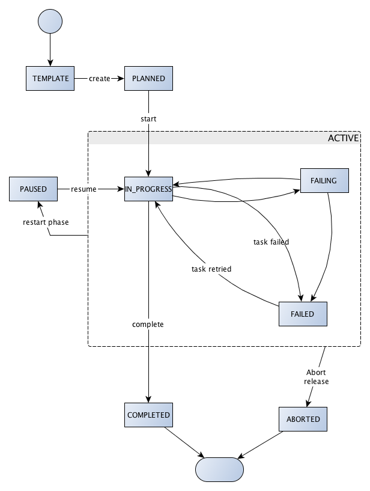

A release can go through various stages. First a blueprint of a release is defined as a *template*. From the template, a *planned release* is created. The release is a copy of the template, but it has not started yet. When it is started, the release becomes *active* and the phases and the tasks are executed. When all is done, the release is *completed*.

This is a detailed breakdown of the states that a release can go through.

All releases are derived from a template (it can be an empty template), so the first state of a release is *template*.

When a release is created from a template, a copy is made from the template and the release is *planned*.

When the release starts, it enters the *in progress* state. Phases and tasks are started and notifications are sent to task owners to pick up their tasks.

The state of an *active* release is reflected in the state of the current task. In the case of multiple tasks running in a parallel group, the state of the topmost parallel group is used.

* *In progress*: The current task is in progress.
* *Failed*: The current task has failed. The release is halted until the task is retried.
* *Failing*: Some tasks in a parallel group have failed, but other tasks are still in progress.

You can restart a phase when the release is any active state ('in progress', 'failed', or 'failing'). After a phase is restarted, the release is in 'paused' state. This is a state in which no tasks are active. It is similar to the 'planned' state, and allows the release owner to change due dates and other task variables before the release is resumed.

There are two end states: *completed* and *aborted*. When the last task in a release finishes, the release enters the 'completed' state. A release can be manually aborted at any point, at which point it will be in the 'aborted' state.

## Running release

In a running release, XL Release starts planned tasks in the correct order and executes them if they are automated, or sends a notification to the users who are responsible for their completion if they are not automated.

Generally, one or more tasks will be active at any given time. Users who have tasks assigned to them will find these tasks in their task overview. Users are expected to mark tasks as complete in XL Release when done.

If an active task is failed, the release is paused. The release owner must then decide whether to assign the task to another user or to skip it.

Also, the release may be stalled after a phase is restarted. In this situation, tasks are copied and may have erroneous start and due dates, or may be assigned to the wrong users. The release owner should configure the tasks correctly before carrying on.
