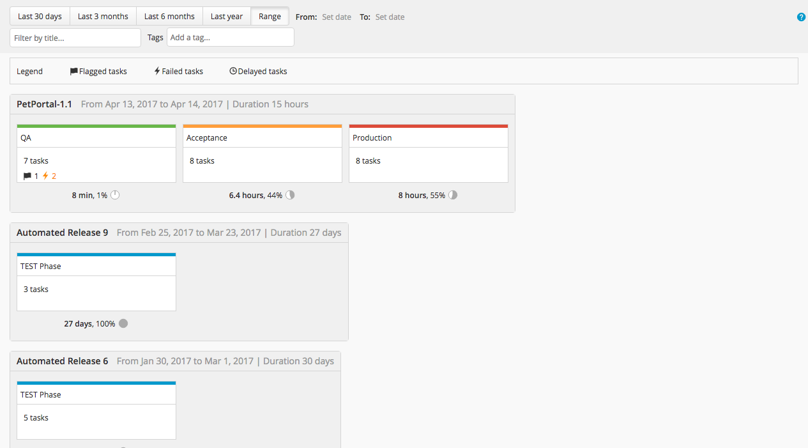
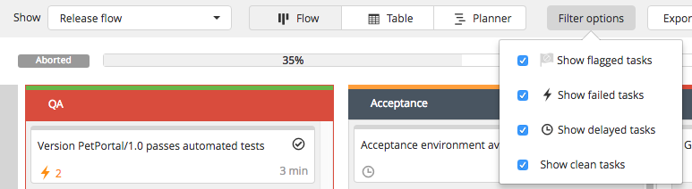
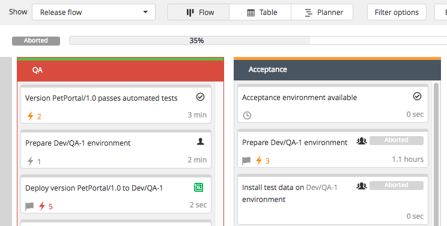

The XL Release release value stream report focuses on the quality of [completed and aborted](/xl-release/concept/release-life-cycle.html) releases. The data for this report comes from XL Release's [archive database](/xl-release/concept/how-archiving-works.html). Releases that are completed or aborted but not yet archived do not appear in reports.

Releases appear in this report in descending order. Under each phase of a release, you can see its duration and the proportion of the total duration that the phase took.

To access the XL Release release value stream dashboard, click **Dashboards** from the top menu and then click the **Release value stream** tab. Use the buttons at the top of the report to select a time period such as "Last 6 months" or a specific date range. Type a part of a release title or release tags in the **Filter by title...** and **Add a tag...** boxes. When you start typing the release tag name, the tag autocompletes from a database of a maximum of 500 tags.

## Phase metrics and critical phases

Each release phase can show these criticality metrics:

* Flags: Total number of flags that were added to tasks in the phase
* Failures: Total number of task failures in the phase
* Delays: Total number of tasks in the phase that were completed after their due date

XL Release marks a phase as "critical" when the sum of these metrics is greater than 6; you can customize this value in the [report settings](/xl-release/how-to/configure-xl-release-general-settings.html#reports).

The name of a critical phase appears on a red background. The total number of critical phases in a release is shown in the release header.

## Filter tasks

You can filter tasks by metric; use the **Show clean tasks** option to see tasks for which all metrics are zero.

## Open a release

Click a release to open it in the [release flow editor](/xl-release/how-to/using-the-release-flow-editor.html).

Each task shows its individual value for the criticality metrics (if non-zero). The failure count appears in yellow if there were at least two failures and in red if there were at least four failures. You can customize these values in the [report settings](/xl-release/how-to/configure-xl-release-general-settings.html#reports).
