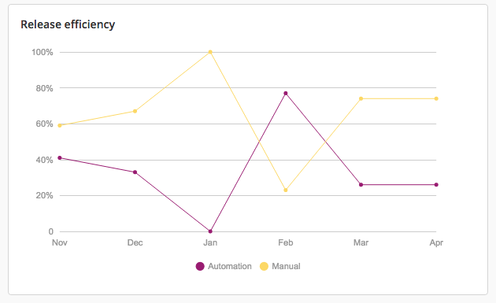
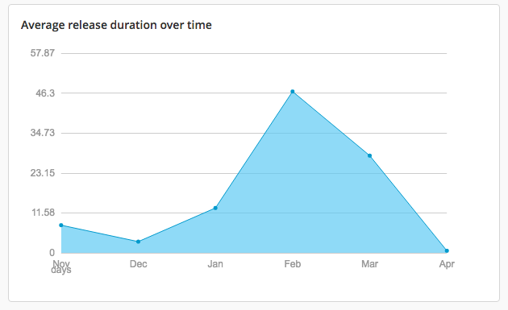
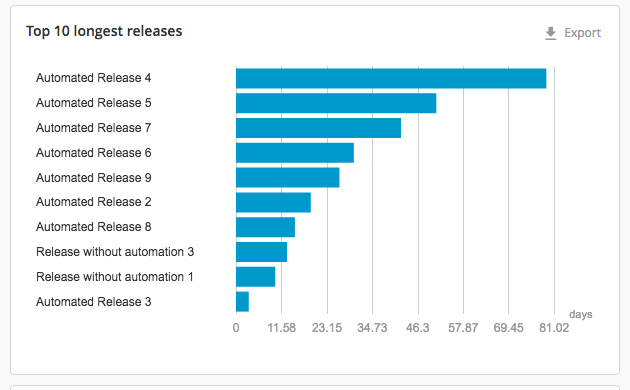

The XL Release reports dashboard provides important information such as releases that have been flagged and which releases have the highest level of automation. The data for this report comes from XL Release's [archive database](/xl-release/concept/how-archiving-works.html). Releases that are completed but not yet archived do not appear in reports.

To access the reports dashboard, click **Dashboards** from the top menu and then click the **Reports** tab. Use the buttons at the top of the report to select a time period such as "Last 6 months" or a specific date range. Type a part of a release title or release tags in the **Filter by title...** and **Add a tag...** boxes. When you start typing the release tag name, the tag autocompletes from a database of a maximum of 500 tags.

## Release information tiles

* **Completed releases** tile: The number of completed releases and the number of templates used to start the releases.
* **Longest task type** tile: The type of the task that has the longest duration and the number of releases where the task is present.
* **Avg. release duration** tile: The average duration of a release and the longest duration of a release.
* **Avg. task duration** tile: The average duration of a task and the longest duration of a task.

## Task efficiency and time spent

The **Task efficiency** chart displays the percentages of automated tasks and manual tasks out of the total number of executed tasks. The **Time spent** chart displays the percentages of time spent for automated tasks and manual tasks out of the total number of days.

## Release efficiency

The **Release efficiency** section displays a graph that provides an overview of your overall level of automation during the selected time period. It shows the following information about [completed](/xl-release/concept/release-life-cycle.html) releases in the selected time period:

* Total numbers of tasks and time spent
* A comparison of the percentage of automated tasks and manual tasks
* A comparison of the time spent on automated tasks and manual tasks

## Average release duration over time

The **Average release duration over time** section allows you to assess whether your level of automation improved over time during the selected time period. It shows the percentage of automated tasks in [completed](/xl-release/concept/release-life-cycle.html) releases during the selected time period, aggregated per month.

## Number of releases

The **Number of releases** section shows how many releases were [completed](/xl-release/concept/release-life-cycle.html) in each month in the selected time period.

## Top 10 longest releases and phases

The **Top-10 Longest Releases** section shows the ten releases that were [completed](/xl-release/concept/release-life-cycle.html) in the selected time period that had the longest duration. **Top-10 Longest Phases** shows the ten phases from these releases that had the longest duration. Both are shown in descending order.

Click a release name to open it in the [release flow editor](/xl-release/how-to/using-the-release-flow-editor.html).

## Top 10 longest tasks

The **Top-10 Longest Tasks** section shows the ten tasks with status *completed* or *completed in advance* in the selected time period that had the longest duration. It also shows the task owner (the most recent assignee).

## Top 10 people most involved (Removed as of XL Release version 7.5)

The **Top-10 People Most Involved** section shows the users who spent the most time and handled the most tasks in the selected time period. To calculate this, XL Release groups the tasks with status *completed* or *completed in advance* by owner (that is, the most recent assignee), calculates their durations, and sorts them in descending order.

