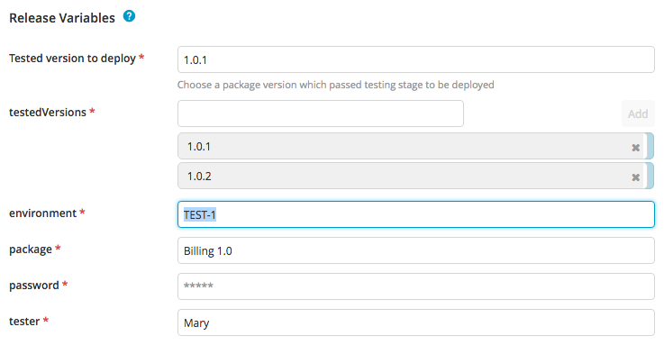
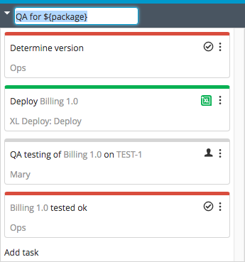
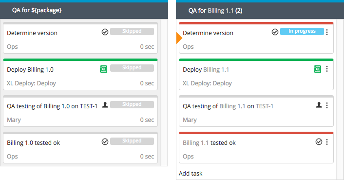

For data that may change or that is not known in advance, XL Release provides a placeholder mechanism in the form of [variables](/xl-release/concept/variables-in-xl-release.html).

This example shows a template that deploys an application to a test environment and assigns testing to QA. When testing succeeds, XL Release sends an email notification. If testing fails, we try again with the next version of the application.

This is the template:

The variable `${package}` is used in the phase title and in the titles of various tasks. This variable is also used to instruct XL Deploy to deploy this package:

Click **New Release** to create a release from the template. XL Release scans the template for variables and asks the user to provide values for all of them.

After the release is created, the release flow appears with the values of the variables filled in.

Note that you can still change variables by editing the fields on the Release properties page.

Now suppose that QA testing for BillingApp 1.0 failed and we need to repeat the procedure for the next version delivered by the Development team.

Click **Restart Phase** to restart the QA phase. Before the release flow resumes, you can change the variables of the release.

When the release resumes, the phase is duplicated with the new variable values in place (the old phase still has the old values).

