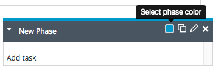

In XL Release, the phases in a template or release represent blocks of work that happen in succession. To add a phase to a template or release, use the [release flow editor](/xl-release/how-to/using-the-release-flow-editor.html); it shows the phases and tasks in the release and allows you to add, move, edit, and delete them.

To add a phase:

1. In the template or release, select **Release Flow** from the **Show** menu.
1. Click **Add Phase**. A new phase with title 'New Phase' appears.

    

1. Click the phase title to change it.
1. Optionally move the phase by dragging it to the desired position.

    **Tip:** You can expand or collapse a phase by clicking the arrow in the header.

1. Optionally select a different color for the phase.
1. Click  to view a description of the phase and its start date, due date, and duration.

     XL Release uses the dates and duration when displaying the phase in the planner and calendar; if they are not consistent with the release dates (as defined in the [release properties](/xl-release/how-to/configure-release-properties.html)), a warning appears.

    

## Copy a phase

To copy a phase, click . This is useful during modeling when you have similar or identical phases. When you duplicate a phase that is active and has running and completed tasks, the tasks in the new phase are all in the *planned* state.

## Delete a phase

To delete a phase, click . Note that you cannot delete a completed or active phase of a running release.
