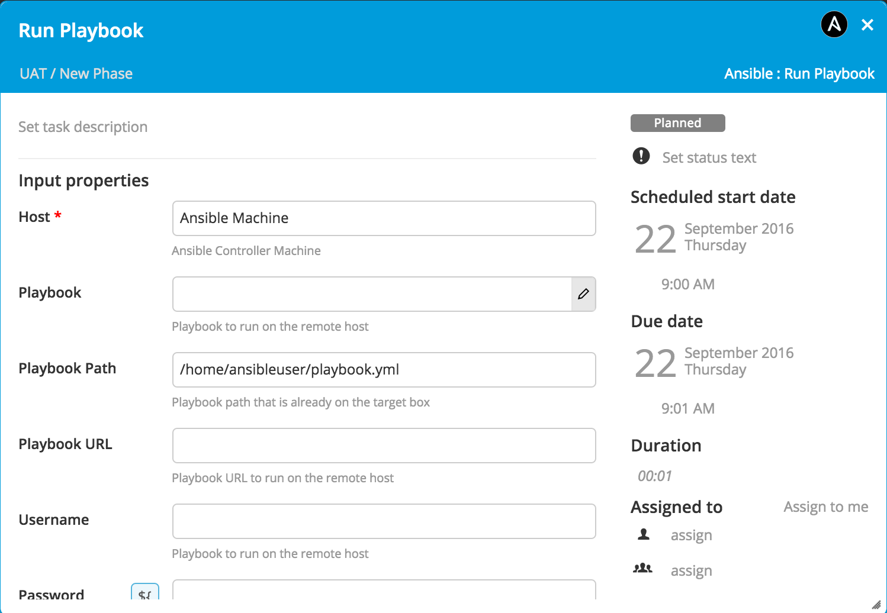
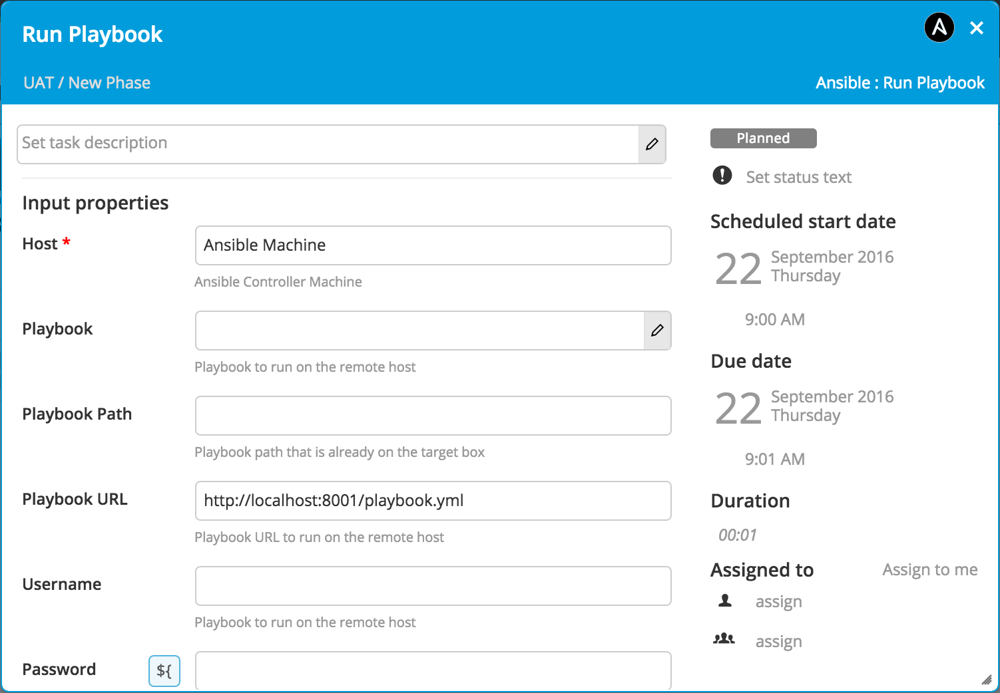

The XL Release [Ansible](https://www.ansible.com/) plugin allows XL Release to run playblooks on an Ansible host. It includes the following task types:

* **Ansible: Run Playbook**

In the [release flow editor](/xl-release/how-to/using-the-release-flow-editor.html), Ansible tasks have a blue border.

## Features

* Run a playbook on an Ansible server

## Requirements

The Ansible plugin requires the XL Release [Remoting plugin](/xl-release/how-to/remoting-plugin.html) to be installed.

## Set up an Ansible server

To set up a connection to a Unix server running Ansible:

1. In XL Release, go to **Settings** > **Shared configuration** and on **Unix Host** click . You can also set up the configuration on a specific folder. For more information, see [Folder level configuration](/xl-release/how-to/manage-templates-and-releases-using-folders.html#folder-level-configuration).

    **Note:** Prior to XL Release 6.0.0, go to **Settings** > **Configuration**.

2. In the **Address** box, enter the IP address or host name of the remote machine running Ansible.
3. In the **Port** box, enter the SSH port of the remote machine.
4. In the **Username** and **Password** boxes, specify the user name and password of the SSH user that XL Release should use when connecting to the remote machine.
5. In the **Sudo Username** box, enter the user name of the `sudo` user on the remote machine (for example, `root`).

    

## Run Playbook task type

The **Ansible: Run Playbook** task type runs an Ansible playbook. It requires you to specify the playbook in YAML format. You can specify the playbook:

* By providing YAML in the task
* By providing the location of a YAML on the remote machine
* By providing a URL to a YAML file

You can enter the YAML as plain text in the **Playbook** box:

Or provide the location of a YAML file that already exists on the target Ansible server in the **Playbook Path** box:

Or provide a URL for the configuration file in the **Url** box. If the URL is secure, you must also provide credentials in the **Username** and **Password** boxes.

