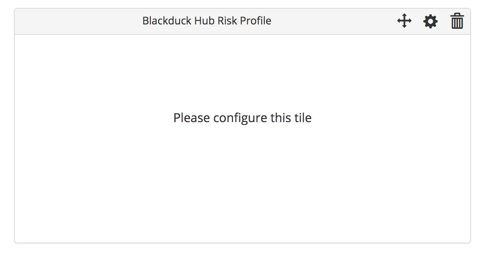
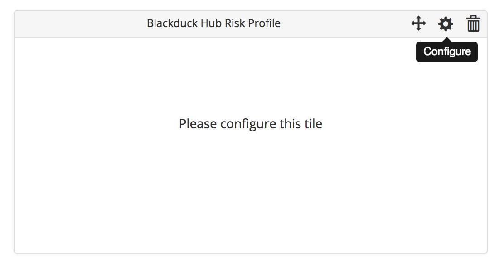

The XL Release Blackduck plugin allows you to monitor various risks as analyzed by [Blackduck](https://www.blackducksoftware.com/) and take action in XL Release (for example: fail or pass a release based on the severity and volume of these risks in Blackduck).

The plugin provides summary tiles for the Blackduck Hub that show counts of components with various risks each with various severities.

A gate task is included in the plugin that allows you to configure various thresholds which determine if the task passes or fails.

In the [release flow editor](/xl-release/how-to/using-the-release-flow-editor.html), the Blackduck Check Compliance task has a red border.

## Release notes

### XL Release Blackduck plugin 8.0.0

#### Improvements

* Compatibility with XL Release 8.0.0

#### Bug Fixes

* DEPL-12985: Fixed Last Analysis date formatting

### XL Release Blackduck plugin 7.6.2

#### Bug Fixes

* REL-6280: Bug fixes for IE11

### XL Release Blackduck plugin 7.6.1

#### Improvements

* [REL-6148] Show timestamps of last scan in logs for task and summary tile

### XL Release Blackduck plugin 7.6.0

## Features

The plugin added to XL Release provides:

* A type of Blackduck Server to configure the host running the Blackduck Hub
* A task of type Blackduck -> Check Compliance
* A summary tile of type Blackduck Risk Profile

## Requirements

To use the plugin, add it to the plugins directory of XL Release. The plugin requires the following:

* The Blackduck Hub server running and accessible via HTTP(S)
* The scan results available on the Blackduck Hub server

## Defining a Blackduck Server

To set up a connection to a Blackduck Hub Server:

1. In XL Release, go to **Settings** > **Configuration**, click **Blackduck: Server**, and select **Add Server**.

  

2. In the **Title** box, enter the identifier for this Blackduck server.
3. In the **Url** box, enter the IP Address or hostname with the port where the Blackduck Hub Server can be reached.
4. In the **Trust Certificate** box, you can select to trust all SSL certificates exposed by the server.
5. In the **Username** and **Password** boxes, specify the user name and password of the Blackduck Hub Server.

  

After the server connection is set up, you can create a release or template with tasks for checking thresholds of various risks according to the Blackduck Hub.

## Check Compliance Task

The **Check Compliance** task creates a gate in the release flow which can break the flow if the count of components of various risks are greater than the configured thresholds.

In the new release, add a task of type **Blackduck** > **Check Compliance**.

1. Select the Blackduck server where the results are stored.
2. Specify the **Project Name** and the **Project Version**.
3. Configure the thresholds for each type of risk for each severity. Each threshold sets the maximum allowed count of components for that risk and severity.

## Blackduck Risk Profile Tile

The Blackduck Risk Profile tile shows a summary of a risk type displayed as a graph, for example: Security Risk, License Risk, or Operational Risk.

The graph shows the number of components categorized according to severity for the configured risk type.

To configure the Blackduck Risk Profile tile:

1. Go to release dashboard and select **Screen** > **Configure** > **Add tile**.
2. Choose **Blackduck Hub Risk Profile** and click **Add tile**.

    

3. A blank tile appears with the message **Please configure this tile**. Click **Configure**.

    

4. Specify the **Project Name** and the **Project Version** and select the type of risk to display the summary on the tile.
5. Click **Save**.

    

The tile should show data related to the risk type configured for the Project.

