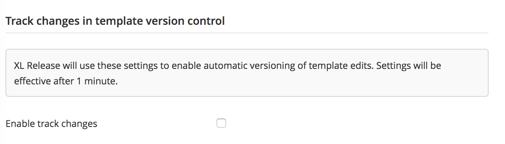
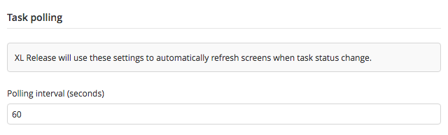
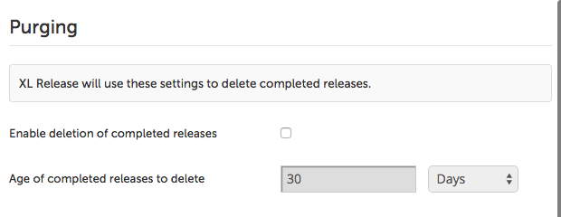
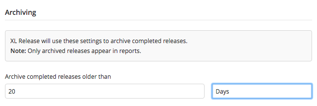

To configure XL Release, select **Settings** > **General settings** from the top menu. The General settings page is only available to users who have the *Admin* [global permission](/xl-release/how-to/configure-permissions.html).

## Track changes in version control

To enable the track changes feature in XL-Release 8.1.0 and later:
1. Go to **Settings** > **General**.
1. In the **Track changes in template version control section**, select the **Enable track changes** checkbox.     

To enable the track changes feature in previous versions of XL-Release, see [Enable automated template versioning](xl-release/how-to/using-template-version-control.html#enable-automated-template-versioning).

## XL Release header color

You can configure the color scheme of the XL Release header and menu bar items. For each type of your XL Release instance, you can define an associated color.

Select a color from the list and specify the name of you environment (for example: Production, Development). You can set a short description for the selected XL Release instance.

## Reports

Use the **Reports** section to configure thresholds used in the [release value stream](/xl-release/concept/reports-in-xl-release.html#release-value-stream) screen.

## Polling

Use the **Polling** section to configure the polling interval to automatically refresh screens when task status change.

## Purging

In XL Release 4.6.0 you can configure XL Release to delete completed releases to prevent the database from growing. By default this is disabled.

When you enable purging, you can configure the time after which XL Release will delete a completed release. This is an amount of time since the release was completed or aborted.

In XL Release 4.7.0 and later, the [archiving feature](/xl-release/how-to/configure-xl-release-general-settings.html#archiving) replaces the purging feature.

## Archiving

In XL Release 4.7.0 and later, you can configure XL Release to archive finished (that is, completed and aborted) releases. These releases are moved to a separate internal *archive database* so that the active repository can be kept relatively small.

Archived releases are available in reports and you can search for them from them Release Value Stream Mapping screen. However, you cannot search for them in the Release Overview screen.

You can configure the time after which XL Release will archive a completed release. This is an amount of time since the release was completed or aborted.

For more information, refer to [How archiving works](/xl-release/concept/how-archiving-works.html).

**Note:** XL Release reports related to finished releases only use data from the archive database. Therefore, if you configure a very long period before releases are archived, then your reports will not be up-to-date. Also, having a large number of releases that are not archived negatively affects performance. For more information about the configuration of the database, refer to [Configure the archive database](/xl-release/how-to/configure-the-archive-database.html).
