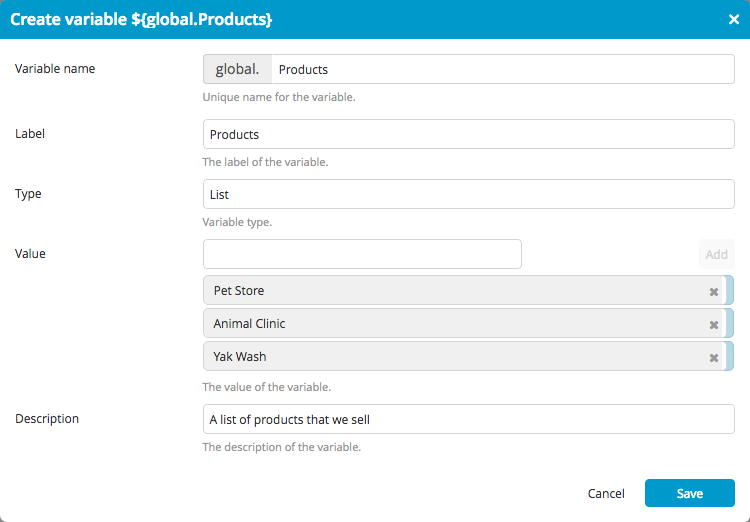

You can use [variables](/xl-release/concept/variables-in-xl-release.html) to manage information that you don't know in advance or that may change. Global variables can be used in all templates and releases to manage shared information (unlike [release variables](/xl-release/how-to/create-release-variables.html), which are limited to a single release or template). Global variables are available in XL Release 4.8.0 and later.

To create, edit, and delete global variables, select **Settings** > **Global variables** from the top menu. The Global variables page is only available to users who have the *Edit Global Variables* [global permission](/xl-release/how-to/configure-permissions.html).

## Create a global variable

To create a global variable:

1. Click **New global variable**.
1. In the **Variable name** box, enter a name for the variable. The `global.` prefix is required.
1. In the **Label** box, optionally enter a user-friendly label for the variable.
1. Select the variable type from the **Type** list:
    * **Text**: A string of letters or numbers
    * **List box**: A drop-down list of selectable values that can be reordered and can contain duplicates (available in XL Release 6.0.0 and later)
    * **Password**: A password
    * **Checkbox**: A true or false value (Boolean)
    * **Number**: An integer
    * **List**: A list of values that can be reordered and can contain duplicates
    * **Set**: A set of values that cannot be reordered and cannot contain duplicates
    * **Key-value map**: A set of keys and corresponding values
    * **XL Deploy environment**: An [environment](/xl-deploy/concept/key-xl-deploy-concepts.html#environments) defined in an [XL Deploy server](/xl-release/how-to/configure-xl-deploy-servers-in-xl-release.html) ([available prior to XL Release 6.1.0](/xl-release/6.1.x/releasemanual.html#xl-release-610-upgrade-notes))
    * **XL Deploy package**: A [deployment package](/xl-deploy/concept/key-xl-deploy-concepts.html#deployment-packages) defined in an XL Deploy server ([available prior to XL Release 6.1.0](/xl-release/6.1.x/releasemanual.html#xl-release-610-upgrade-notes))

    **Tip:** Password variables can only be used in password fields, and other types of variables can only be used in non-password fields.

1. Next to **Value**, enter the value(s) for the variable. To add a value to a list or a set, type the value in the box and press ENTER.

    If a global variable does not have a value and it is used in a task, it will appear as a blank space in the task.

1. In the **Description** box, optionally enter a user-friendly description of the variable.

    

1. Click **Create** to create the variable.

## Edit a global variable

To edit a global variable, click it. Note that you cannot change the variable's name or type.

If you change the variable's value, planned tasks that use that variable will reflect the new value. Completed, skipped, or failed tasks will reflect the old value.

## Delete a global variable

To delete a global variable, click **Delete** under **Actions**.

If you delete a global variable that is still in use, tasks that use the variable will not be able to start.
