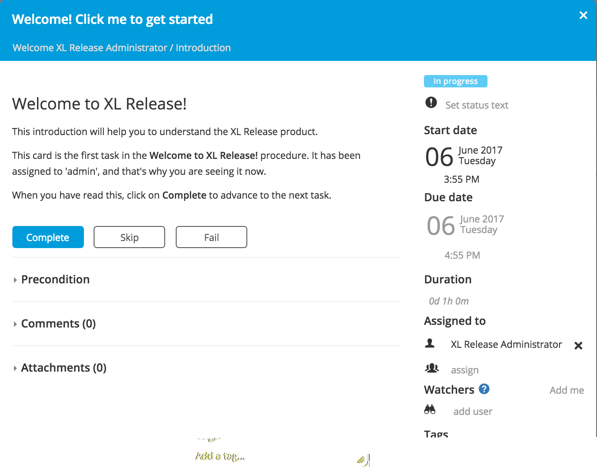
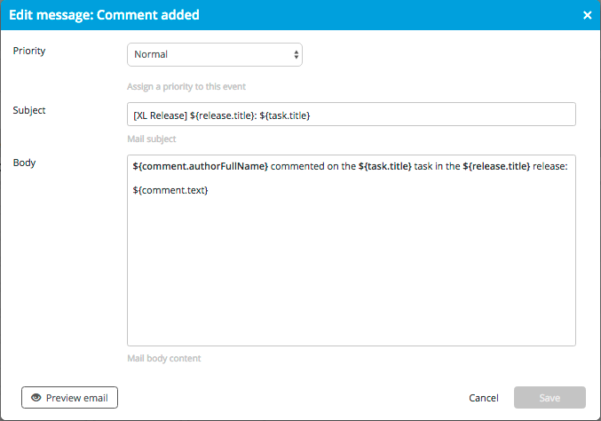

You can configure the email notification preferences in XL Release by adding events that trigger notifications and by modifying the recipients that receive the email notifications.

To view or edit the default email notification settings, select **Settings** > **Notification settings** from the top menu. The Notification page is only available to users who have the *Admin* global permission.

  

There are two types of default notification events: at task level and at release level. For a more detailed description of the default notification events, refer to [Notifications in XL Release](/xl-release/concept/notifications-in-xl-release.html).

For each notification event, you can add or remove the recipients that receive the email notifications.
To remove a recipient from a notification event, click the **x** next to the recipient name.
To add a new recipient, click in a row for a specific event, type the name of the recipient you want to add, and then click **Enter**.

The available email recipients are:

* Release Admin
* Task Owner
* Task Team
* Watcher

**Note:** When only the task owner is set in the notifications settings screen for an event and there is no task owner set on a task, the email notifications are sent to the task team.

## Add watchers on tasks

You can add yourself as a *Watcher* on tasks to receive email notifications when events occur on those tasks. To add other users as watchers on a task, you must have the edit task permission.

  

For more information on how to add a *Watcher* on a task, refer to [Working with tasks](/xl-release/how-to/working-with-tasks.html).

## Edit default notification message

To edit the default notification email for a specific event, click **Edit message** for that event. You can customize the email template that will be sent when the notification event is triggered.

  

You can change the **Subject** and the body text of the email template.

**Note:** You can style the body text in the email using HTML or markdown. For more information, see [Using Markdown in XL Release](/xl-release/how-to/using-markdown-in-xl-release.html).

To assign a high priority to the email notification, select **High priority** from the **Priority** drop down menu.

You can use these supported variables in the email template:

* `$ {url}` the server URL provided in the configuration
* `$ {release.*}` the release properties (the variable is available in release, task, and comment emails)
* `$ {task.*}` the task properties (the variable is available in task and comment emails)
* `$ {comment.*}` the comment properties (the variable is available in comment emails)
* `$ {release.url}` the direct URL to the release
* `$ {task.url}` the direct URL to the task
* `$ {task.ownerFullName}` the full name of the task owner
* `$ {task.descriptionHtml}` the task description that was processed by markdown
* `$ {task.dueInHours}` the number of hours until the task is due
* `$ {task.dueInMinutes}` the number of minutes until the task is due
* `$ {comment.authorFullName}` the full name of the author of the comment
* `$ {comment.textHtml}` the comment text that was processed by markdown

To open and view the email template in a new browser tab, click **Preview email**.

  

  **Note:** The task description is always included by default in the email template.

If you have made modifications to the email template and you want to revert to the latest saved changes, click **Cancel**.

**Important** If you are using Chrome web browser to open an email notification received for an event that occurred on a task or release and you click **View task** or **View release**, the browser redirects the `http://` link to an `https://` link and you will receive an error message. To fix this, manually replace `https://` with `http://` in the address bar. You can also go to `chrome://net-internals` and select `HSTS`, remove the XL Release domain name and then clear your browser cache.
