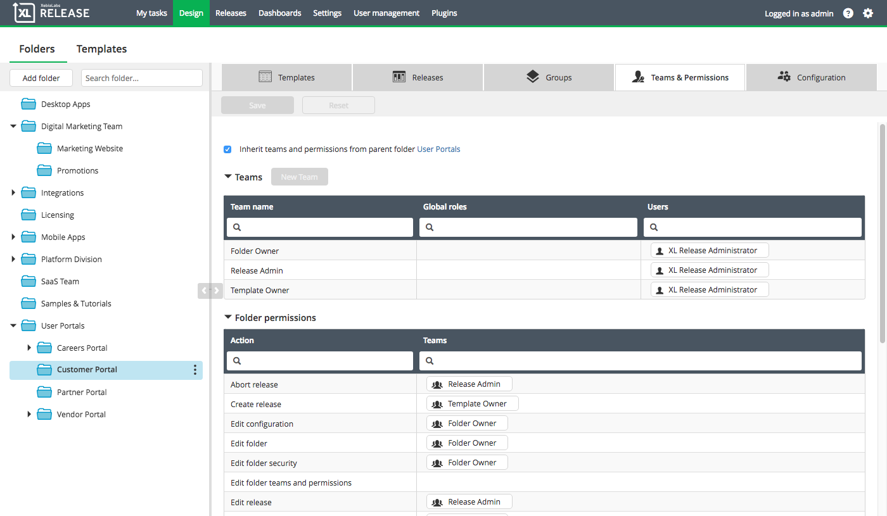

In XL Release, you use **teams** to group users who have the same role.  You can assign permissions to teams on the folder level, template level, and release level. When designing the release flow of a template or a release, you can assign tasks to teams. Team members will then be responsible for completing the task and will be notified when the task starts.

## Teams and permissions in folders

With XL Release 6.0.0, folders were introduced. Now templates and releases can be stored in a folder, or not in any folder at all.

In the latter case, teams and permissions are set directly on templates and releases, like previous versions of XL Release.

In XL Release 6.0.0 and later, templates and releases that are stored in a folder _always_ take the security settings of the folder they are in. So if you create a template in a folder or move a template to a folder, there are no individual settings on the template; you must define teams and permissions on the folder level.

A folder may inherit teams and permissions from its parent folder. The inheritance model is all or nothing: you either inherit all settings from the parent folder (or the parent's parent), or you define all settings on the folder itself. This means that if you clear the **Inherit permissions from parent folder** option on the folder, all settings are copied and are no longer in sync with the parent folder.

## Configure teams

To configure release teams in XL Release 6.0.0 and later:

1. Select **Design** > **Folders** from the top bar.
2. Select a folder.
3. Go to the **Teams & Permissions** tab.
4. Click **Add team** to add a new team.
5. Add [roles](/xl-release/how-to/configure-roles.html) by typing in the **Global roles** column. Add individual users by typing in the **Users** column.
6. Click **Save** to save your changes.

In XL Release 5.0.x and earlier, you add teams by opening the template or release and going to **Show** > **Teams**.

### Predefined teams

XL Release automatically creates the following predefined teams, which you cannot remove:

{:.table .table-striped}
| Team | Description | Default permissions |
| ---| ----------| ----------|
| Folder owner | People that manage the folders, subfolder, and folder security. | All folder permissions. |
| Template owner | People that design the templates. | All template permissions. |
| Release Admin | Contains the release owners, the people responsible for executing the release. Members of this team receive extra notifications when, for example, a task fails and the release is halted. | All release permissions. |

Note that you are free to add and remove people to these teams, and to assign permissions to them.

## Configure permissions

You can configure permissions on templates and releases if you have the _Edit Template Security_ or _Edit Release Security_ permission on a specific template or release, or if you have the _Edit Security_ [global permission](/xl-release/how-to/configure-permissions.html). This applies to all releases and templates in XL Release 5.0 and previous versions. In XL Release 6.0.0 and later versions, it only applies for templates and releases that are not stored in a folder.

When using folders, you can only configure permissions on a folder and you need to have the _Edit Folder Security_ permission on the folder to do so. The global _Edit Security_ permission does not apply to folders.
In XL Release 8.1 and later, you can view the **Teams & Permissions** tab if you have the _Edit folder teams and permissions_ permission. In this tab, you cannot view the _Edit folder teams and permissions_ and _Edit Folder Security_ permissions or the teams that have these permissions. 
You can view all the permissions and teams in the folder if you have the _Admin_ global permission or the _Edit folder security_ permission on the folder. 

To configure permissions in XL Release 6.0.0 and later:

1. Select **Design** > **Folders** from the top bar.
2. Select a folder.
3. Go to the **Teams & Permissions** tab.

    If the folder is the child of another folder, the **Inherit permissions from parent folder** option is selected by default. If you want this folder to have different permissions, clear this option.

4. Under **Folder permissions**, add release teams to each permission.
5. Click **Save** to save your changes.

In XL Release 5.0.x and earlier, you configure permissions by opening the template or release and going to **Show** > **Permissions**. In XL Release 6.0.0 and later, the Permissions screen provides a read-only view of the permissions on the template or release.

**Note:** As of XL Release 8.0, is it possible to lock tasks. When a task is locked only users with lock permissions are able to edit or unlock it. A locked task appears striped to indicate that it is locked.  For more information, see [Configuring lock tasks](http://docs.xebialabs.com/xl-release/how-to/configure-lock-tasks.markdown).

**Note:** As of XL Release 8.1, a new permission is available: _Edit folder teams and permissions_. Teams with this permission can manage the team composition and the permissions of all the teams within the folder, similar to the "Folder Owner" permission. There are two limitations:
 1. Cannot modify teams that have the permissions "Edit folder security" or "Edit teams and permissions".
 2. Cannot add or remove the permissions "Edit folder security" or "Edit teams and permissions".

### Folder permissions

Folder permissions are available in XL Release 6.0.0 and later. The following permissions apply to folders:

{:.table .table-striped}
| Permission | Description |
| ---------| ----------|
| View folder | Users can see the folder in the Folders screen. |
| Edit folder | Users can edit the folder (for example, by renaming it). |
| Edit folder security | Users can edit the teams and permissions on a folder. |
| Edit teams and permissions (XL Release 8.1 and later) | Users can edit the teams and permissions on a folder, with the limitations listed above. |
| Edit configuration | Users can see, create, and edit the configuration in the Folders screen. |

### Template permissions

The following permissions apply to templates:

{:.table .table-striped}
| Permission | Description |
| ---------| ----------|
| Create release | Users can create a release from the template. |
| View template | Users can see the template in the template overview. |
| Edit template | Users can change the template by adding tasks and phases and changing them. |
| Edit template security | Users can edit teams and permissions on the template; this permission is named _Edit Security_ prior to XL Release 6.0.0. |
| Edit triggers | Users can view, edit, and delete triggers on the template; this permission is available in XL Release 6.0.0 and later. To create a trigger, you also need the *Create Release* permission. |
|Lock template task  (XL Release 8.0 and later) | When a template task is locked only users with lock permissions are able to edit or unlock it.   |

### Release permissions

The following permissions apply to releases:

{:.table .table-striped}
| Permission | Description |
| ---------| ----------|
| View Release | Users have view access to this release. It will appear in the Release Overview. In the release details, users have read-only access to the release flow, properties, and activity log. |
| Edit Release | Users can alter the structure of a release by adding and moving tasks and phases. Release properties and teams are editable. |
| Edit Release Security | Users can edit teams and permissions in a release; this permission is named _Edit Security_ prior to XL Release 6.0.0. |
| Start Release | Users can start a planned release. |
| Abort Release | Users can abort an active or planned release. |
| Reassign Task | Users can assign tasks to other people. Team assignment is also enabled. |
| Edit Task | Users can edit individual tasks. |
| Edit Task Blackout| Users can enable or disable the Postpone during blackout period setting at task level. |
|Lock release task  (XL Release 8.0 and later) |  When a release task is locked only users with lock permissions are able to edit or unlock it.  |
