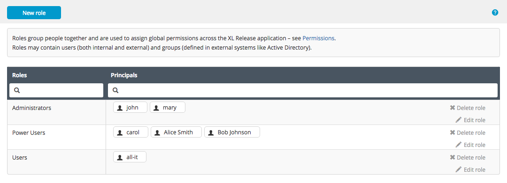

XL Release has a role-based security system with two types of users:

* [_Internal users_](/xl-release/how-to/configure-user-settings.html) that are managed by XL Release
* [_External users_](/xl-release/how-to/configure-ldap-security-for-xl-release.html) that are maintained in an LDAP repository such as Active Directory

You assign internal users, external users, and external user groups to _roles_, which determine the [global permissions](/xl-release/how-to/configure-permissions.html) that they have. The technical term for a user or group that is assigned to a role is a _principal_.

To configure roles, select **User management** > **Roles** from the top menu. The Roles page is only available to users who have the *Admin* or *Edit Security* global permission.

**Note:** Prior to XL Release 6.0.0, select **Settings** > **Roles**.

In this example, the users *john* and *mary* have the *Administrators* role, while all users in the *all-here* group are members of the *Users* role.

You can give a role any name you want; there are no predefined role names.

To:

* Add a new role, click **New role**
* Delete a role, click the **X** next to it
* Change the name of a role, click it
* Add a principal to a role, type the name and press ENTER

**Note:** To filter the lists of roles or principals, click in one of the search boxes and type the assigned role or principal you want to find.

Click **Save** to apply your changes. Click **Reset** to discard your changes and reload the current settings from the server.
