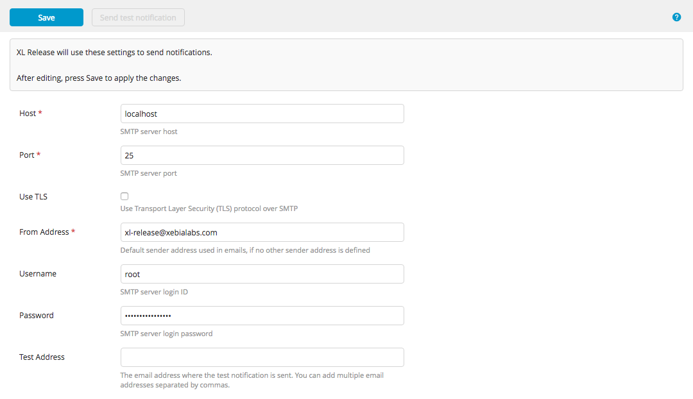

XL Release sends [notifications](/xl-release/concept/notifications-in-xl-release.html) to users of the system by email. To configure the email server that is used to send notifications, select **Settings** > **SMTP server** from the top menu. The SMTP server page is only available to users who have the *Admin* [global permission](/xl-release/how-to/configure-permissions.html).

**Host** is used to specify the internet address of the mail server, followed by the **Port** it is listening on. Consult your system administrator on the values to use and whether to use **TLS** to secure the connection.

Most SMTP servers require authentication. Use the **Username** and **Password** fields to set the credentials of the user that will connect. The **From Address** is the sender address that is used in the emails. People will receive emails on behalf of this user. You must enter a valid email address, but you can add a name by using the following syntax: `Full name <name@example.com>`. Note that some mail servers will ignore this setting and set the authenticated user as the sender of the emails.

Click **Send test notification** to send a test email to the email addresses specified in the **Test Address** field. To send the test email to multiple email addresses, specify the test addresses separated by commas. If the specified information is correct, an email is sent confirming the test connection was successful.

Click **Save** to apply your changes.
