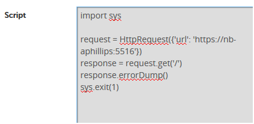
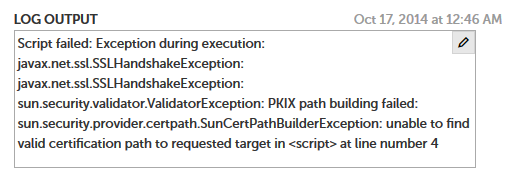

Version 4.0.10 of XL Release introduced `HttpRequest`, a new underlying base class for HTTP requests which is used in webhooks and is available in custom tasks. `HttpRequest` is based on [Apache HTTP Components](https://hc.apache.org/) (Apache HC). This offers more configuration options around HTTP than Jython's implementation of [`httplib`](http://www.jython.org/docs/library/httplib.html), which was used previously (usually via [the deprecated `XLRequest` base class](/xl-release/how-to/support-legacy-use-of-xlrequest-using-httprequest.html)).

Apache HC's default SSL configuration aims for security, failing to accept things like hostname mismatches between a target host and its certificate (some of the default settings cause slightly different behavior when compared to the old `XLRequest` class).

Here are some examples of how to configure the Apache HC client in `HttpRequest` with different SSL options. These are based on a fresh 4.0.10 installation of XL Release for SSL has been enabled and a self-signed certificate for `localhost` has been generated.

## Extract HttpRequest to the extensions directory

Create one of the following directories, if it does not already exist:

* For XL Release 4.7.x or earlier: `XL_RELEASE_SERVER_HOME/ext/pythonutil`
* For XL Release 4.8.0 or later: `XL_RELEASE_SERVER_HOME/ext/xlrelease`

Extract the `HttpRequest.py` class (in `XL_RELEASE_SERVER_HOME/lib/server-<version>.jar`) into the directory. This will override the `HttpRequest.py` class provided in the JAR file. You can do this by copying the JAR file to a temporary directory, opening it with a ZIP file browser (change the file extension to `.zip` if necessary), and extracting the file from the `pythonutil` or `xlrelease` directory.

## Set up a sandbox template with a test task

Create a simple "sandbox" release template with a single script task to test the various settings:

This fails on two counts, as expected: first, it's a self-signed certificate and, secondly, the certificate is for `localhost`, not `nb-aphillips` (the machine's hostname):

## Configure `HttpRequest` to trust self-signed certificates

As a first step, configure `HttpRequest` to trust the self-signed certificate. This means changing `HttpRequest` to not use Apache HC's [default `HttpClient` object](https://hc.apache.org/httpcomponents-client-ga/httpclient/apidocs/org/apache/http/impl/client/HttpClients.html#createDefault%28%29), but one that is configured with the required SSL options. Here, the original `client = HttpClients.createDefault()` call is commented out and a `createHttpClient` method that returns a client configured to trust all certificates has been added.

    from org.apache.http.conn.ssl import SSLContextBuilder, SSLConnectionSocketFactory, TrustSelfSignedStrategy
    ...
    def executeRequest(self, request):
        client = None
        response = None
        try:
            # replace the original default client with a call to our new method
            #client = HttpClients.createDefault()
            client = self.createHttpClient()
            ...
    # we're adding this method to the class
    def createHttpClient(self):
        # see the Javadoc for SSLConnectionSocketFactory for more options
        builder = SSLContextBuilder()
        builder.loadTrustMaterial(None, TrustSelfSignedStrategy())
        socketfactory = SSLConnectionSocketFactory(builder.build())
        # print 'DEBUG: Created custom HttpClient to trust all certs\n'
        return HttpClients.custom().setSSLSocketFactory(socketfactory).build()

Note that an additional import statement for the required classes to the initial section of `HttpRequest.py` has also been added.

Now, there is only a hostname mismatch:

## Configure `HttpRequest` to ignore hostname mismatches

Configuring the HTTP client to also ignore hostname mismatches is a matter of adding an additional configuration option in the new `createHttpClient` method:

    def createHttpClient(self):
        builder = SSLContextBuilder()
        builder.loadTrustMaterial(None, TrustSelfSignedStrategy())
        # now also adding ALLOW_ALL_HOSTNAME_VERIFIER here
        socketfactory = SSLConnectionSocketFactory(builder.build(), SSLConnectionSocketFactory.ALLOW_ALL_HOSTNAME_VERIFIER)
        # print 'DEBUG: Created custom HttpClient to trust all certs and allow hostname mismatches\n'
        return HttpClients.custom().setSSLSocketFactory(socketfactory).build()

You can also configure the client to only ignore hostnames (but not trust self-signed certificates):

    def createHttpClient(self):
        socketfactory = SSLConnectionSocketFactory(SSLContextBuilder().build(), SSLConnectionSocketFactory.ALLOW_ALL_HOSTNAME_VERIFIER)
        # print 'DEBUG: Created custom HttpClient to allow hostname mismatches\n'
        return HttpClients.custom().setSSLSocketFactory(socketfactory).build()

In this case, you can also remove `TrustSelfSignedStrategy` from the `org.apache.http.conn.ssl import ...` line, as it is not used.

With this change, the test task can call the server successfully:

Code samples are based on [this useful Stack Overflow post](https://stackoverflow.com/questions/19517538/ignoring-ssl-certificate-in-apache-httpclient-4-3). Thanks, [mavroprovato](https://stackoverflow.com/users/89435/mavroprovato)!

**Note:** In the light of the [POODLE SSL vulnerability](http://googleonlinesecurity.blogspot.nl/2014/10/this-poodle-bites-exploiting-ssl-30.html), another SSL configuration option you may wish to consider is to allow only TLS connections. See the [Javadoc for `SSLConnectionSocketFactory`](https://hc.apache.org/httpcomponents-client-ga/httpclient/apidocs/org/apache/http/conn/ssl/SSLConnectionSocketFactory.html) for information about how to construct the socket factory to achieve this.

**Important:** The code here is sample code only that is not officially supported by XebiaLabs. If you have questions, please [contact our support team](https://support.xebialabs.com/).
