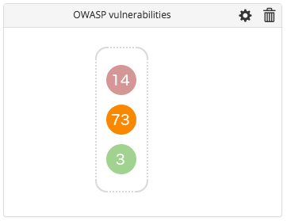

The dependency check tile for [XL Release release dashboards](/xl-release/how-to/using-the-release-dashboard.html) allows you to quickly see the number of high, medium, and low-priority vulnerabilities found in the libraries used in your applications, so you can assess the potential security risk of using them. Vulnerability information is provided by the the [Open Web Application Security Project (OWASP)](https://www.owasp.org/index.php/Main_Page), a worldwide non-profit organization focused on improving software security.

To use this tile:

1. Install the [OWASP Dependency-Check Plugin](https://wiki.jenkins-ci.org/display/JENKINS/OWASP+Dependency-Check+Plugin) in your Jenkins instance and follow the plugin instructions to create a Jenkins job that will check for vulnerabilities.
1. Log in to XL Release as an administrator.
1. Go to **Settings** > **Shared configuration** and add your Jenkins server.

**Note:** Prior to XL Release 6.0.0, go to **Settings** > **Configuration**.

1. Open a template or release and select **Release dashboard**.
1. Click **Configure** to configure the dashboard.
1. Click **Add tile** and select the dependency check tile.
1. On the tile, click .
1. Select your Jenkins server.
1. Enter the name of the Jenkins job that you created to check for vulnerabilities.
1. Save the tile.
1. Click **Back to view mode** on the release dashboard.

The tile will show a traffic light with the number of high priority (red), medium priority (yellow), and low priority (green) vulnerabilities found by the OWASP dependency check.
