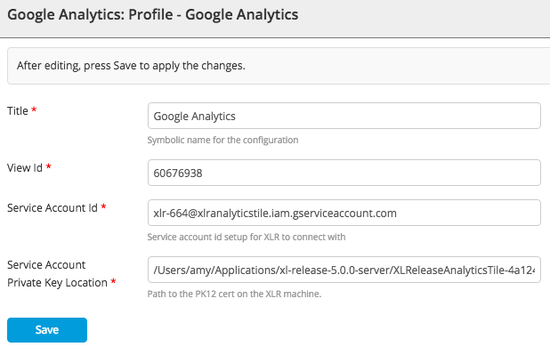
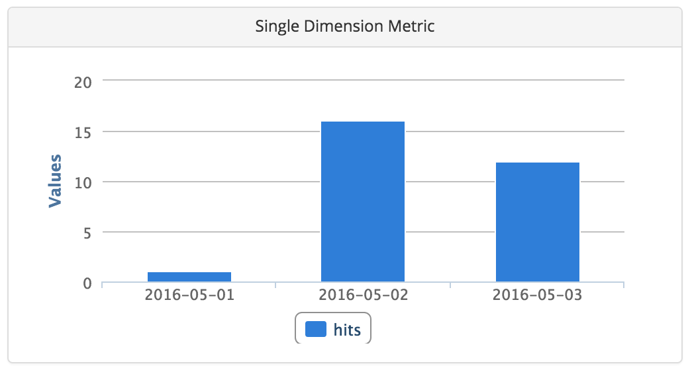

The Google Analytics tile for XL Release [release dashboards](/xl-release/how-to/using-the-release-dashboard.html) allows you to monitor Google Analytics data during a configured period. You can use this tile to analyze the outcome of a software release by comparing metrics gathered before the release to those gathered during a post-release monitoring period.

## Set up a Google Analytics profile

First, set up a Google Analytics profile in XL Release:

1. Go to **Settings** > **Shared configuration** and click **Add Profile** under **Google Analytics: Profile**.

    **Note:** Prior to XL Release 6.0.0, go to **Settings** > **Configuration**.

2. In the **Title** box, enter a unique name for the profile.
3. In the **View ID** box, enter the ID of the Google Analytics view to use for this profile.
4. In the **Service Account ID** box, enter the ID of the Google Analytics service account to use for this profile.
5. In the **Service Account Private Key Location** box, enter the location on the XL Release server where the private key for the service account is saved.
6. Click **Save**.

## Configure the Google Analytics tile

To configure a Google Analytics tile on a release dashboard:

1. In a release or template, select **Release dashboard**.
1. Click **Configure**, then click **Add tile**.
1. Select the _Single Dimension Metric_ tile.
1. On the tile, click .
1. Select the desired Google Analytics profile from the **Profile** list.
1. In the **Start Date** and **End Date** boxes, enter the start and dates for the query, in `YYYY-MM-DD` format. You can use [variables](/xl-release/how-to/create-release-variables.html) in these fields.
1. In the **Dimension** and **Metric** boxes, enter the Google Analytics dimension and metric to use. Refer to the [Dimensions & Metrics Explorer](https://developers.google.com/analytics/devguides/reporting/core/dimsmets) for the items that are available.
1. In the **Filter** box, enter the Google Analytics filter to use. Refer to the [Core Reporting API Reference Guide](https://developers.google.com/analytics/devguides/reporting/core/v3/reference#filters) for information about filters.
1. Click **Save**.
1. On the dashboard, click **Back to view mode**.

The tile is not active in a [template](/xl-release/how-to/create-a-release-template.html); it will become active when you create a release from the template. After the tile's configured start date, it will show data for each consecutive day until the configured end date.

