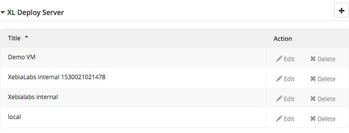
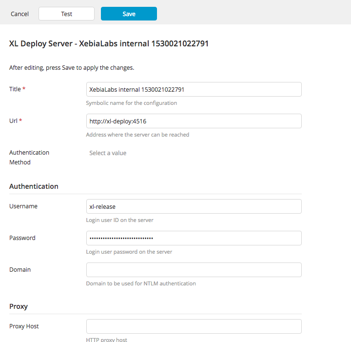

To configure connections between XL Release and [XL Deploy](/xl-deploy/) servers, select **Settings** > **Shared configuration** from the top menu and go to the **XL Deploy Server** section. Before XL Release 6.1.0, the configuration page is located at **Settings** > **XL Deploy servers**.

The XL Deploy server configuration is only available to users who have the *Admin* [global permission](/xl-release/how-to/configure-permissions.html).

To add a server:

1. Click **Add XL Deploy Server**.
2. In the **Title** box, enter a name for the server. This is how the server will be identified in XL Release.
3. In the **URL** box, enter the address at which the server is reachable. This is the same address you use to access the XL Deploy user interface.
4. In the **Username** and **Password** boxes, enter the credentials of the XL Deploy user that XL Release will use to log in. XL Release uses this user to query XL Deploy for the applications and environments that are available.

    It is recommended that you create an XL Deploy user with read-only rights for XL Release to use. To perform deployments, specify a user and password directly in the XL Deploy task. This provides fine-grained access control from XL Release to XL Deploy. If you do not specify a user in the XL Deploy task, then XL Release will use the user configured on the XL Deploy server to perform deployments (provided that user has deployment rights in XL Deploy).

5. Click **Test** to test if XL Release can log in to the XL Deploy server with the configured address and credentials.
6. Click **Save** to save the server.

