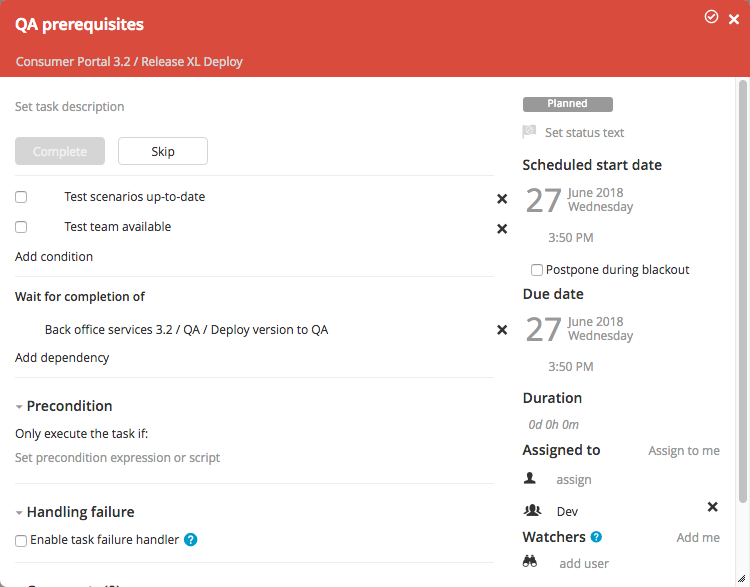
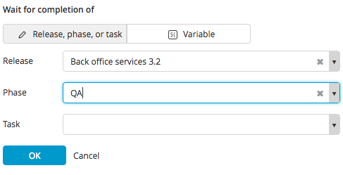

A Gate task contains conditions that must be fulfilled before the release can continue. There are two types of conditions: simple checkboxes and dependencies on other releases.

In the [release flow editor](/xl-release/how-to/using-the-release-flow-editor.html), Gate tasks have a red border.

## Checkbox conditions

When you open a Gate task, you will see the checkbox conditions on the task. If you have the [*Edit Task*](/xl-release/how-to/configure-permissions-for-a-release.html) release permission, you can add a checkbox by clicking **Add condition**. To remove a condition, click the cross icon.

Checkboxes must be completed by users who are involved in the release. When a Gate task is active, it can only be completed after all of its conditions are met; that is, after all checkboxes have been ticked. The Gate task will not automatically complete when the conditions are met; the task assignee must mark it as complete.

## Dependencies

The Gate task also shows dependencies on other releases. A Gate task can wait on other releases, on the level of release, phase, or task. In the example above, there is a dependency on the "Deploy version to QA" task in the "QA" phase of the "Back office services 3.2" release.

Click **Add dependency** to create a new dependency or click an existing dependency to edit it.

Use the dependency editor to select the conditions for the dependency:

* The release the Gate will wait on (only current releases appear)
* The release phase the Gate will wait on (optional)
* The release task the Gate will wait on (optional)

When the Gate contains dependencies and no conditions, it completes _automatically_ when all dependent releases, phases, or tasks are complete.

When a dependent task or release fails, the Gate does not fail. It waits until the release is restarted and the task is completed or skipped. A Gate fails if a release it depends on is aborted.

### Using variables in dependencies

In XL Release 5.0.0 and later, you can use variables instead of direct release dependencies by clicking  and selecting a variable of type *text*. XL Release will search for a release, phase, or task with the ID stored in the variable. If the ID is valid, then the variable dependency will be replaced with a normal dependency and the release will proceed as usual. If the ID is not valid, does not exist, or is empty, then the Gate task will fail.

You can use this feature in combination with the [Create Release task](/xl-release/how-to/create-a-create-release-task.html) to start a release and require the initial release to wait at the Gate until the new release is compete.
