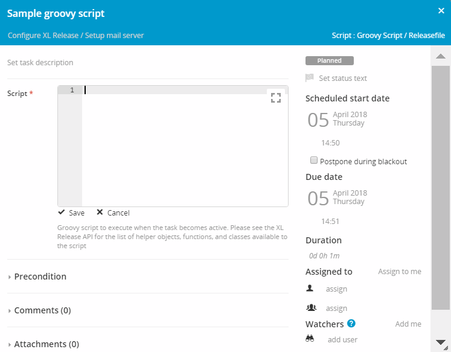

A Groovy Script task contains a [Groovy script](http://www.groovy-lang.org/) that is executed on the XL Release server. This is an automated task that completes when the script finishes successfully.

As of XL Release version 7.5.0, the inline script editor is used to enter script. Type or paste a Groovy script into the **Script** field of the Groovy script task details. To enlarge the script editor, click . Pressing this button again will minimize the editor.

**Note:** The output of the remote script task is in markdown format. For more information, refer to [Using Markdown in XL Release](/xl-release/how-to/using-markdown-in-xl-release.html).

In the [release flow editor](/xl-release/how-to/using-the-release-flow-editor.html), Groovy Script tasks have a gray border.

## Variables and public API access

You can access `releaseVariables` and `globalVariables` from a script, which gives you the same set of API services that are available for the [Jython Script task type](/xl-release/how-to/create-a-jython-script-task.html). You can use `releaseVariables` and `globalVariables` in a script, in addition to the [release-as-code API](/xl-release/6.1.x/dsl-api/).

You cannot use the XL Release-style `${myReleaseVar}` expression in a Groovy Script task because it is a valid syntax of the Groovy language. This means that XL Release does not support variable interpolation for Groovy Script tasks (however, you can use this syntax in Jython Scrip tasks).

For example:


def server(type, title) {
  def cis = configurationApi.searchByTypeAndTitle(type, title)
  if (cis.isEmpty()) {
    throw new RuntimeException("No CI found for the Type and Title")
  }
  if (cis.size() > 1) {
    throw new RuntimeException("More than one CI found for the Type and Title")
  }
  cis.get(0)
}

def globVar = globalVariables['global.globalVariable']

def myReleaseVar = releaseVariables['myReleaseVar']


## Security and Groovy Script tasks

When a Groovy Script task becomes active, the script is executed in a sandbox environment on the XL Release server. This means that the script has very restricted permissions. By default, access to the file system, network, and non API related classes is not allowed.

To remove these restrictions, add a `script.policy` file to the `XL_RELEASE_SERVER_HOME/conf` directory.
This is a standard [Java Security Policy file](http://docs.oracle.com/javase/7/docs/technotes/guides/security/PolicyFiles.html) that contains the permissions that a script should have.

To enable the use of additional Java packages or classes in the script, use the following XL Release specific `RuntimePermission`:

    permission  com.xebialabs.xlrelease.script.security.RuntimePermission "accessClass.com.company.domain.*";
    permission  com.xebialabs.xlrelease.script.security.RuntimePermission "accessClass.com.company.utils.HelperClass";

You must restart the XL Release server after creating or changing the `XL_RELEASE_SERVER_HOME/conf/script.policy` file.

## Sample script

This sample script creates a release containing one [Manual task](/xl-release/how-to/create-a-manual-task.html):


xlr {
  release("Sample release with a Manual task") {
    description "Sample template created from Groovy DSL"
    phases {
      phase {
        title "Sample"
        tasks {
          manual("Manual task") {
            description "Manual task description"
          }
        }
      }
    }
  }
}

