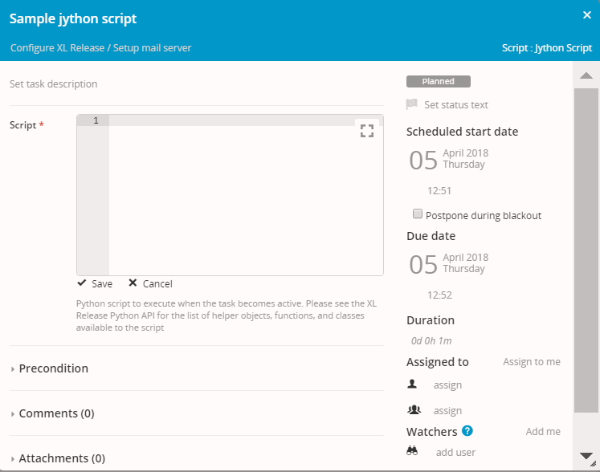

A Jython Script task contains a Jython script that is executed on the XL Release server. This is an automated task that completes when the script finishes successfully.

As of XL Release version 7.5.0, the inline script editor is used to enter script. Type or paste a Jython script into the **Script** field of the Jython script task details. To enlarge the script editor, click . Pressing this button again will minimize the editor.

 XL Release 4.7.0 and later supports Jython 2.7. Jython is the Java implementation of Python. This means that you have access to standard Python as well as the Java libraries included in Java 7.

**Note:** The output of the Jython Script task is in markdown format. For more information, refer to [Using Markdown in XL Release](/xl-release/how-to/using-markdown-in-xl-release.html).

You can access and modify [release variables](/xl-release/concept/variables-in-xl-release.html) in your scripts using the dictionary named `releaseVariables`. This sample script shows how to access and modify a variable:


print(releaseVariables['xldeployPackage'])
releaseVariables['xldeployPackage'] = 'XL Release'


In a similar way, you can modify [global variables](/xl-release/how-to/configure-global-variables.html) using the dictionary named `globalVariables`. Note that you can always read the values of the global variables, but if you want to update them, ensure that **Run automated tasks as user** of the release has global _Edit global variables_ permission.

In the [release flow editor](/xl-release/how-to/using-the-release-flow-editor.html), Jython Script tasks have a gray border.

## Security and Jython Script tasks

When a Jython Script task becomes active, the script is executed in a sandbox environment on the XL Release server. This means that the script has very restricted permissions. By default, access to the file system, network, and non API related classes is not allowed.

To remove these restrictions, add a `script.policy` file to the `XL_RELEASE_SERVER_HOME/conf` directory.
This is a standard [Java Security Policy file](http://docs.oracle.com/javase/7/docs/technotes/guides/security/PolicyFiles.html) that contains the permissions that a script should have.

To enable the use of additional Java packages or classes in the script, use the following XL Release specific `RuntimePermission`:

    permission  com.xebialabs.xlrelease.script.security.RuntimePermission "accessClass.com.company.domain.*";
    permission  com.xebialabs.xlrelease.script.security.RuntimePermission "accessClass.com.company.utils.HelperClass";

You must restart the XL Release server after creating or changing the `XL_RELEASE_SERVER_HOME/conf/script.policy` file.

## Sample scripts

This sample script shows how to download a file from a web site and save it locally:


import httplib
url = 'www.xebialabs.com'
file = '/tmp/xebialabs.html'
xl = httplib.HTTPConnection(url)
xl.request('GET', '/')
response = xl.getresponse()
myFile = open(file, 'w')
myFile.write(response.read())
myFile.close()
print "Save %s to %s" % (url, file)


This example allows access to the network using Python `httplib` and read/write access to the `/tmp` directory on the XL Release server:


grant {
    // Network access
    permission  java.lang.RuntimePermission "accessClassInPackage.sun.nio.ch";
    permission  java.net.SocketPermission "*", "connect, resolve";

    // File access
    permission java.io.FilePermission "/tmp/*", "read, write";
    permission java.util.PropertyPermission "line.separator", "read";
};


For an extended example, refer to [Creating XL Release Tasks Dynamically Using Jython API](http://blog.xebialabs.com/2015/08/11/creating-xl-release-tasks-dynamically-using-jython-api/).
