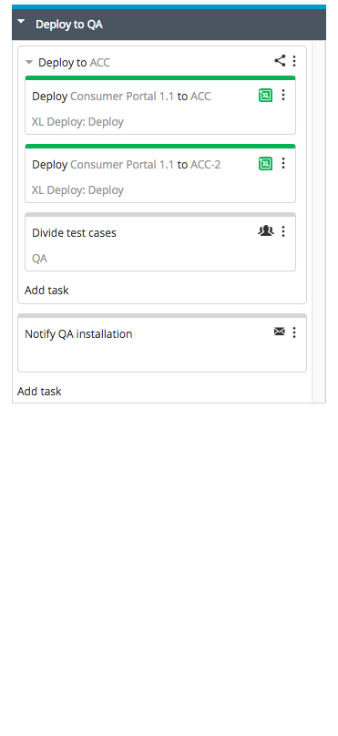
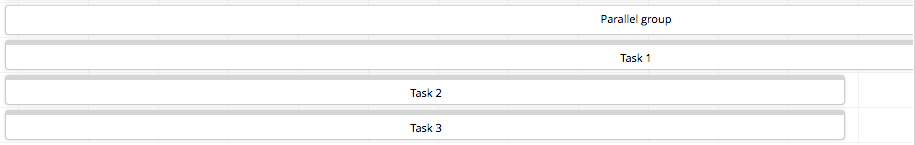
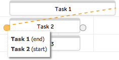

A Parallel Group is a container for tasks that are executed simultaneously.

**Tip:** To group tasks that should be executed in sequence, use the [Sequential Group](/xl-release/how-to/create-a-sequential-group.html) task type (available in XL Release 5.0.0 and later).

To add a Parallel Group to a template or release:

1. Select [**Release Flow Editor**](/xl-release/how-to/using-the-release-flow-editor.html) from the **Show** menu.
1. [Add a task to a phase](/xl-release/how-to/add-a-task-to-a-phase.html), selecting the Parallel Group type.
1. Add tasks to the group by clicking **Add task** in the group or by dragging existing tasks into the group.

In this example, the XL Deploy tasks and the "Divide test cases" task will start simultaneously. The "Deploy to ACC" group will not finish until all of its subtasks are complete. Then, XL Release will continue with the next task, "Notify QA installation".

## Adjust Parallel Groups in the planner

By default, all tasks in a Parallel Group start when the group starts. The [planner](/xl-release/how-to/using-the-xl-release-planner.html) allows you to do planning on a detailed level and explicitly express dependencies between tasks.

This is an example of a Parallel Group with three tasks. Task 1 already has a due date.

 

Connect Task 1 to Task 2 by dragging an arrow from the right edge of Task 1 to the left edge of Task 2.

 

As a result, Task 2 will start at the due date of Task 1.

Task 3 is not connected and because it is inside a Parallel Group, it will start at the same time as Task 1 (when the Parallel Group starts).
