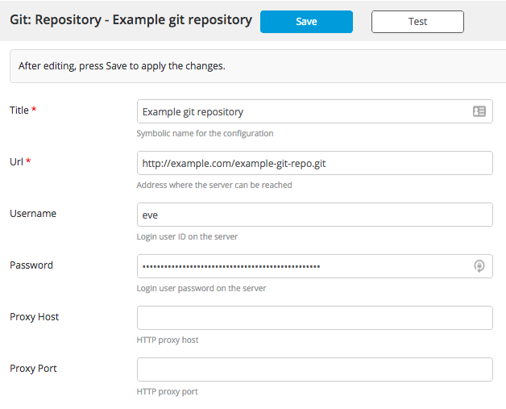

Using a [Git trigger](/xl-release/how-to/git-trigger.html), you can start a release that will execute an External Script task that contains a DSL. The External Script task should point to a file from a Git repository, which means that you must provide HTTP/HTTPS access to the file with a direct link. HTTP authentication provides security.

To start a release:

1. Create a shared configuration for a Git repository:

    

1. Create a template with an External Script task:

    

    You must provide an HTTP/HTTPS URL to your DSL script from a repository; you can protect the URL with HTTP basic authentication.

1. Create a Git poll trigger configuration:

    

Every time you push changes to the repository, the trigger creates a new release and starts it immediately. This allows you to execute DSL from the same Git repository and immediately change the release flow for every commit by creating a new release with a new pipeline.
