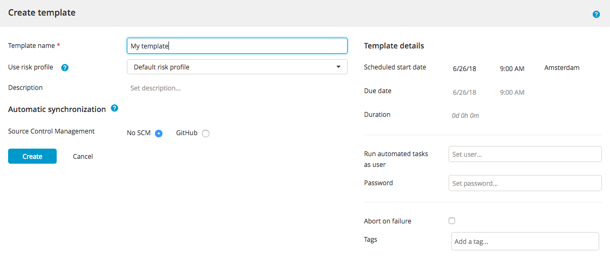

In XL Release, _templates_ are like blueprints for releases. You use templates to model the ideal process of a release flow. A template can describe a procedure that is used to deliver different applications, or it can describe a procedure that is used to release a particular application and that will be reused for different versions of the application.

Templates lack certain properties of actual releases, such as start and end dates. Also, you typically use placeholders such as variables and teams for information about a release that you do not know in advance.

A new release is based on a template. The release is a copy of the template and has the values for the variables filled in, the start and end dates assigned, and the teams populated.

If you change a template, the running releases that were created from it are not updated with the changes. Also, if you change the content or structure of a release, the changes are not automatically propagated to the template that was used to create it.

## Viewing templates

In XL Release 6.0.0 and later, you can:

* View templates organized by [folder](/xl-release/how-to/manage-templates-and-releases-using-folders.html) by selecting **Templates** > **Folders** from the top bar
* View all templates by selecting **Design** > **Templates** from the top bar

In XL Release 5.0.x and earlier, you can view all templates by going to the template overview.

In all cases, you will only see the templates that you have permissions to view.

### Template options

When viewing a list of templates, the following options are available (depending on your permissions):

{:.table .table-striped}
| Action | Description |
| -----| ----------|
| Edit | Open the template in the [release flow editor](/xl-release/how-to/using-the-release-flow-editor.html). |
| New release | Create a new release based on the template. |
| Copy | Create a new template that is a copy of the selected one; if you copy a template that contains [release triggers](/xl-release/how-to/create-a-release-trigger.html), all triggers on the copied template will be disabled.  You will be added as an owner of the new template. However, if you did not have edit permissions on the original template, then all password fields and variables will be stripped. |
| Move | Move the template to a different folder (available in XL Release 6.0.0 and later). |
| Delete | Delete the template. |

## Create a template

To create a template:

1. Start in one of the following places:

    * Go to **Design** > **Templates** and click **New template**
    * Go to **Design** > **Folders**, select a folder, and click **Add template** > **Create new template**
    * Click **New template** on the template overview (prior to XL Release 6.0.0)

    

1. In the **Template Name** box, enter a name to identify the template.
1. In **Scheduled start date** and **Due date**, set the planned start and end dates of the release. XL Release uses these dates to show the release on the calendar. Only the start date is required.
1. If you want the release to be aborted when a task fails, select **Abort on failure**.
1. In **Use risk profile**, select a risk profile from the drop down list. If no risk profile is selected, the **Default risk profile** is used. For more information, refer to [Configure profile risk settings](/xl-release/how-to/configure-risk-settings.html).
1. In the Description box, optionally enter detailed information about the release. This field allows [Markdown](/xl-release/how-to/use-markdown-in-xl-release.html).
1. Under **Automatic synchronization**, specify if you want to save template version in Source Control Management. For more information, see [Configure Source Control Management (SCM) connection](/xl-release/how-to/scm.html#github-connections-options).
1. In **Run release as user** and **Password for user that runs the release**, enter the user name and password of the XL Release user account that should be used to execute scripts.
1. Next to **Tags**, optionally add tags to the release to make it easier to find in the release overview.
1. Click **Create** to create the template.

To discard your changes without saving, click **Cancel**.

### Copy a template

To create a copy of a template:

1. Go to **Design** > **Folders** or **Design** > **Templates** and locate the template that you want to copy.
2. Click **Copy**. A dialog box appears.
3. Adjust the template name and add a description, if desired.
4. Click **Continue**. The new template is copied into the same folder as the original template. You can then optionally move it to a different folder.

In XL Release 5.0.x and earlier, locate the template that you want to copy in the template overview and click **Copy** under it.

**Note:** Template names do not have to be unique because every template has a [unique ID](/xl-release/how-to/how-to-find-ids.html#releases-and-templates) such as `Release29994650`.

If you want to create a new version of a template, it is recommended that you do so by copying the original template and adding a version number to the name of the copy; for example, _Consumer Portal Release Process V4_.

## Template security

In XL Release 6.0.0 and later, you configure release teams and their permissions on the folder level. In earlier versions of XL Release, you configure template and release permissions separately (folder permissions are not available).

For information about security, refer to [Configure release teams and permissions](/xl-release/how-to/configure-release-teams-and-permissions.html).
