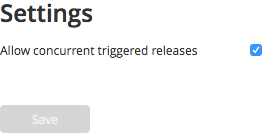

Triggers are an automated way to create and run a release. A trigger is a kind of XL Release plugin that is executed periodically and can create and run a release from a template.

**Important:** A trigger will not trigger a release during its first run; it will wait until the next iteration.

To see the triggers on a template, select **Triggers** from the **Show** menu in the release flow editor. To configure a trigger:

1. Under **Settings**, select **Allow concurrent triggered releases** to allow releases that are started by the trigger's template to run concurrently instead of sequentially.

    For example, if this option is not selected and a trigger's template detects that multiple releases are set to run at the same time, XL Release will only run one triggered release at a time.

    

1. Select a trigger type from the list under **Triggers list**.
1. You can now configure the trigger settings. For example, for a *Git: Poll* trigger:

    

1. In the **Title** box, enter a name that identifies the trigger.
1. In the **Release Title** box, enter a name for releases that will be created by this trigger. This field can contain [variables](/xl-release/concept/variables-in-xl-release.html).
1. Select a polling interval from the **Poll type** list. This can be a repeatable interval in seconds (for example, every 10 seconds) or a [cron](https://en.wikipedia.org/wiki/Cron#CRON_expression) expression.

    For important information about using cron expressions, refer to [Time zone for cron jobs](/xl-release/how-to/time-trigger-plugin.html#time-zone-for-cron-jobs).

1. In the **Poll interval** box, enter the number of seconds between each execution of the trigger or cron expression.
1. To make the trigger active, select **Enabled**.
1. Configure the remaining properties, which are specific to the trigger type.
1. Next to **Tags**, optionally add tags that will be added to releases created by the trigger. This field can contain variables.
1. Under **Template Variables**, define values to use for template variables in releases created by the trigger.

    By default, all template variables with the same name as a trigger variable are automatically bound. For example, a template variable named `commitId` will have the value `${commitId}`, which will be replaced by the corresponding value of the trigger variable. You can also specify static values or other variables.

1. Click **Save** to save the configuration and return to the triggers page.

    

**Note:** All releases created by a trigger are tagged with the ID of the trigger. You can find all releases created by a trigger by clicking **Releases linked to this trigger**.
