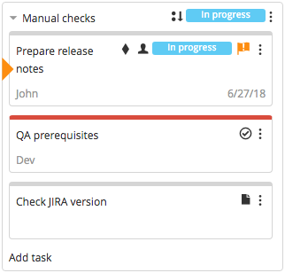

A Sequential Group is a container for tasks that are executed in sequence. A Sequential Group works in the same way as a series of tasks in a phase; however, it provides a useful way to group related tasks within a phase. For example, you could configure a precondition on the group so that all of its subtasks will be skipped under certain conditions. You can also collapse Sequential Groups to make the release flow easier to read.

**Tip:** To group tasks that should be executed simultaneously, use the [Parallel Group](/xl-release/how-to/create-a-parallel-group.html) task type.

To add a Sequential Group to a template or release:

1. Select [**Release Flow Editor**](/xl-release/how-to/using-the-release-flow-editor.html) from the **Show** menu.
1. [Add a task to a phase](/xl-release/how-to/add-a-task-to-a-phase.html), selecting the Sequential Group type.
1. Add tasks to the group by clicking **Add task** in the group or by dragging existing tasks into the group. Drag tasks within the group to adjust their execution order.

In this example, the "Prepare release notes" task has already started; when it finishes, then the "QA prerequisites" task will start. The "Manual checks" group will finish with its last subtask, "Check JIRA version".
