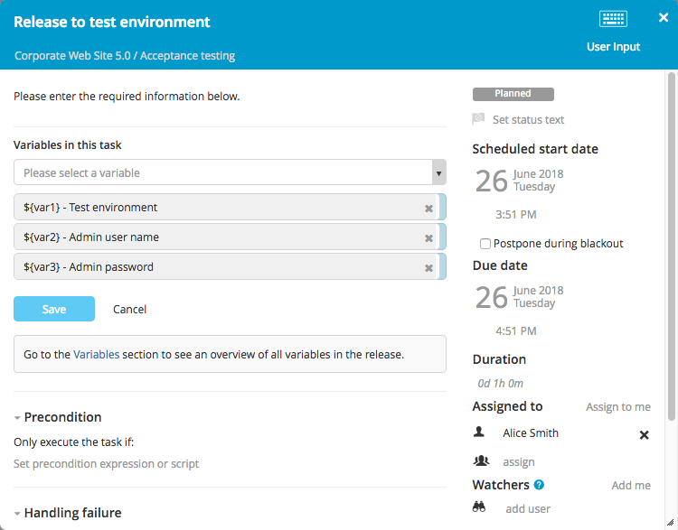

A User Input task is a manual task that allows users to provide values for release variables. These values can then be used in other tasks in the release.

Users with the **Task Edit** permission on a release can add [variables](/xl-release/how-to/create-release-variables.html) to a task.

To add variables to a User Input task, click **Edit variable list**. You can select the variables that have been defined on the release. You can reorder the list by dragging and dropping the selected variables.

In the [release flow editor](/xl-release/how-to/using-the-release-flow-editor.html), User Input tasks have a gray border.
