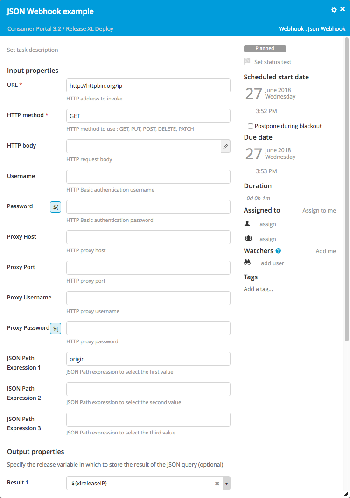

Automatic tasks often need to interact with an external system through a REST interface. You could use a Jython Script task to send an HTTP query and parse the response; but to make this easier, XL Release provides the Webhook task type.

To configure a Webhook, you specify the URL to call and the details of the request (HTTP method, request body, authentication). The task will perform the query, parse the response, and optionally extract results and them it in release variables.

Webhooks are available in XML and JSON, depending on the format of the HTTP response. Each has its own way of extracting a result from the response:

* **XML webhook**: Provide an [XPath](https://en.wikipedia.org/wiki/XPath) expression to select the value.
* **JSON webhooks**: Use a [JSON path](http://goessner.net/articles/JsonPath/).

This example is based on [HttpBin](http://httpbin.org/), a free service to test REST clients. It uses the `/ip` endpoint, which returns the IP of the caller in a JSON response with the following structure:

    {
      "origin": "xxx.xxx.xxx.xxx"
    }

This is the configuration of the task in XL release:

After the task is complete, the `origin` field is extracted from the response and stored in the `${xlreleaseIP}` release variable, where it can be used by other tasks.

In the [release flow editor](/xl-release/how-to/using-the-release-flow-editor.html), Webhook tasks have a blue border.
