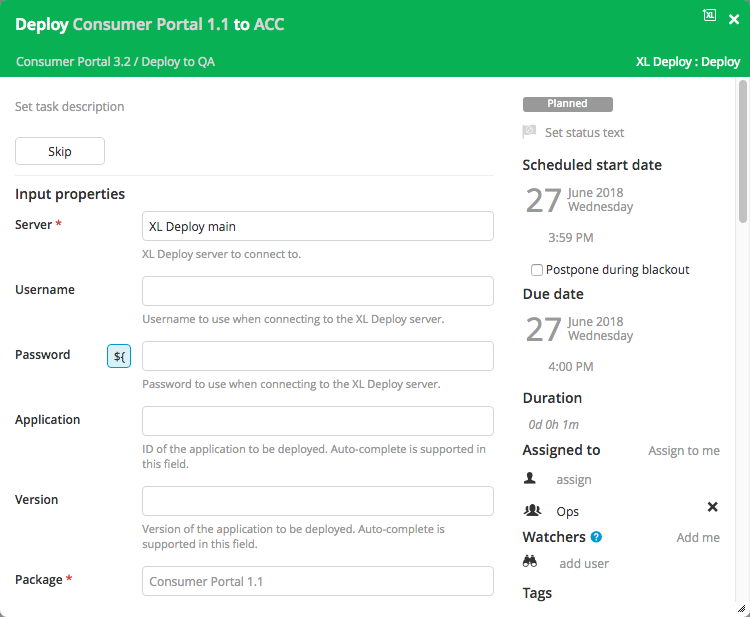

The XL Deploy task provides integration with [XL Deploy](/xl-deploy), XebiaLabs' Application Release Automation solution. It is an automated task that tells XL Deploy to deploy a certain application to an environment. Both the application and environment must be configured in XL Deploy. The task gives live updates of the deployment process and completes automatically when the deployment succeeds.

**Note:** If the deployment fails, it is automatically rolled back.

The options for the XL Deploy task are:

{:.table .table-striped}
| Option | Description |
| -----| ----------|
| Server | XL Deploy server to which XL Release connects. You can configure XL Deploy servers in **Settings** > **[Shared configuration](/xl-release/how-to/configure-xl-deploy-servers-in-xl-release.html)**. |
| Package | Version of the application to be deployed. Start typing and XL Release will retrieve the list of applications from the XL Deploy server. |
| Environment | Environment to which to deploy. Start typing and XL Release will retrieve the list of environments from the XL Deploy server. |
| Username | User name to use when connecting to the XL Deploy server. |
| Password | Password to use when connecting to the XL Deploy server. |

You can also use [variables](/xl-release/concept/variables-in-xl-release.html) in the **Package** and **Environment** fields. This allows you to reuse application version and environment across tasks in XL Release. For example, when using variables, you can mention the name of the application and the environment to which you deployed in a [Notification task](/xl-release/how-to/create-a-notification-task.html).

In the [release flow editor](/xl-release/how-to/using-the-release-flow-editor.html), XL Deploy tasks have a green border.
