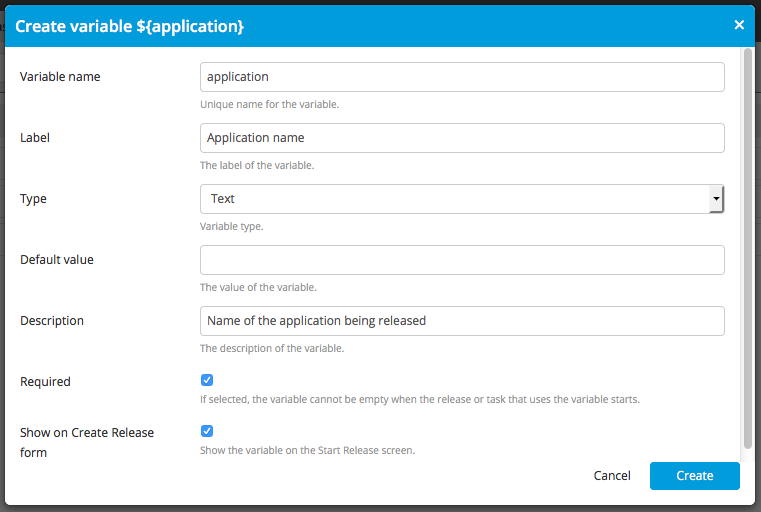

You can use [variables](/xl-release/concept/variables-in-xl-release.html) to manage information that you don't know in advance or that may change. Release variables can only be used in the template or release in which they are created (unlike [global variables](/xl-release/how-to/configure-global-variables.html)). There are two ways to create a release variable.

## Create a release variable in the release flow editor

A simple way to create a release variable is to type its name in a task in the [release flow editor](/xl-release/how-to/using-the-release-flow-editor.html), using the `${ }` syntax. For example, typing `${name}` creates a variable called `name`, which you can then edit on the Variables screen.

The variable's type depends on the type of the field where you created the variable. For example, typing `${name}` in a text field means `name` will be of the type *text*, while typing `${name}` in a password field means `name` will be of the type *password*.

Other properties, such as the variable's label and description, will be left blank. In XL Release 4.8.0 and later, you can edit them on the Variables screen.

**Note:** If you enter a password in the `${variable}` format, XL Release will treat it as a variable, so you cannot use this format for the text of the password itself.

## Create a release variable on the Variables screen

In XL Release 4.8.0 and later, you can also create release variables using the Variables screen:

1. In a release or template, select **Variables** from the **Show** menu.
1. Click **New variable**. The Create Variable screen appears.
1. In the **Variable name** box, enter a name for the variable.
1. In the **Label** box, optionally enter a user-friendly label for the variable. This will appear next to the fields where users can enter a value for the variable.
1. Select the variable type from the **Type** list:
    * **Text**: A string of letters or numbers
    * **List box**: A drop-down list of selectable values that can be reordered and can contain duplicates
    * **Password**: A password
    * **Checkbox**: A true or false value (Boolean)
    * **Number**: An integer
    * **List**: A list of values that can be reordered and can contain duplicates
    * **Set**: A set of values that cannot be reordered and cannot contain duplicates
    * **Date**: A date format (available since XL Release 7.1.0)
    * **Key-value map**: A set of keys and corresponding values
    * **XL Deploy environment**: An [environment](/xl-deploy/concept/key-xl-deploy-concepts.html#environments) defined in an [XL Deploy server](/xl-release/how-to/configure-xl-deploy-servers-in-xl-release.html) ([available prior to XL Release 6.1.0](/xl-release/6.1.x/releasemanual.html#xl-release-610-upgrade-notes))
    * **XL Deploy package**: A [deployment package](/xl-deploy/concept/key-xl-deploy-concepts.html#deployment-packages) defined in an XL Deploy server ([available prior to XL Release 6.1.0](/xl-release/6.1.x/releasemanual.html#xl-release-610-upgrade-notes))

    **Tip**: To prevent the display of passwords, password variables can only be used in password fields. Any other type of variable cannot be used in password fields.

1. Next to **Default value**, optionally enter a value for the variable. To add a value to a list or a set, type the value in the box and press ENTER.
1. In the **Description** box, optionally enter a user-friendly description of the variable. This will appear below the fields where users can enter a value for the variable.
1. If the variable must have a value, select **Required**.
1. To allow users to enter or change the variable's value when starting a release, select **Show on Create Release form**.

    

1. Click **Create** to create the variable.

### How required variables work

If a variable is required and you selected **Show on Create Release form**, then the variable must have a value before the release can start. This can be the default value that you set for the variable in the template, or a value that the user enters when [starting the release](/xl-release/how-to/start-a-release-from-a-template.html).

If a variable is required and it is used in a task, then the variable must have a value before the task can start. This can be the default value that you set for the variable in the template or release, or a value that the user enters before the task becomes active. If a required variable is missing a value when the task becomes active, then the task is not started, but remains in the *needs input* state until a user enters a value.

**Note:** In XL Release 4.7.x and earlier, all release variables must have a value before the release can start.

## Edit a release variable

To edit a variable in a template or a running release, select **Variables** from the **Show** menu, then click the desired variable. Note that you cannot change the variable's type.

If you change the variable's value, planned tasks that use that variable will reflect the new value.
Completed, skipped, or failed tasks will reflect the old value (except in the case of user input tasks, which always show the variable's current value).

## Delete or replace a release variable

To delete or replace a variable in a template or a running release, select **Variables** from the **Show** menu, then click **Delete/Replace** next to the desired variable.

If the variable is not being used in the template or release, simply confirm that you want to delete it.

If the variable is still in use, XL Release allows you to choose how it will replace the variable wherever it appears in the template or release. You can replace the variable with:

* A static value
* A different variable (in `${ }` format)
* A blank space

After XL Release replaces all occurrences of the variable, it deletes the variable.
