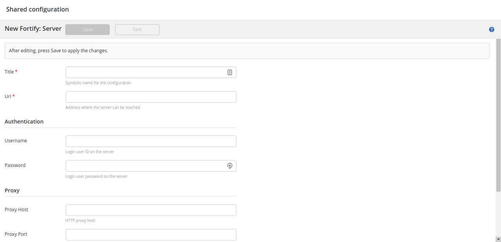
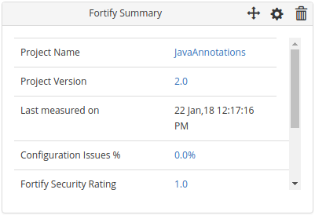

The XL Release [Fortify SSC](https://software.microfocus.com/en-us/products/software-security-assurance-sdlc/overview) plugin allows XL Release to work with reports and metrics from a Fortify Software Security Center(SSC) server.

The following task types are included:

* **Fortify: Check Compliance**

In the [release flow editor](/xl-release/how-to/using-the-release-flow-editor.html), the Fortify SSC tasks have a red border.

The following tile types are included:

* **Fortify Summary**

## Features

* Create a Fortify: Check Compliance task
* Configure a Fortify Summary tile on the Release dashboard

## Requirements

The Fortify SSC plugin requires the following:

* Fortify SSC server running and accessible via HTTP(s)
* An application and version should be created. A FPR artifact uploaded and processed in the version

## Set up a Fortify SSC server

Define a Fortify server as the first item under shared configurations.

To set up a connection to a Fortify SSC server:

1. In XL Release, go to **Settings** > **Shared configuration** and under **Fortify: Server**, click **Add Server**.
1. In the **Title** box, specify a symbolic name for the Fortify server.
1. In the **URL** box, specify the URL where the Fortify SSC server can be reached.
1. In the **Username** and **Password** boxes, specify the login user name and password of the user on the server.

## Create Fortify: Check Compliance task

The **Fortify: Check Compliance** task type creates a gate in the release flow, that fails if the the **Minimum Security Rating** is not reached in the specified project name and version.

To add a Fortify: Check Compliance:

1. In the release flow tab of a Release template, add a task of type **Fortify** > **Check Compliance**.
1. Open the added task and in the **Server** box, select the added Fortify server.
1. In the **Project Name** and **Project Version**, add the project for which the compliance needs to be verified.
1. In the **Minimum Security Rating** box, add the minimum rating that is required for the project to pass compliance. The Minimum Security Rating defaults to 5.

## Fortify Summary tile

The **Fortify: Summary** tile type creates a dashboard tile that displays the metric information of the selected project and version.

To configure a Fortify Summary tile:

1. In the release dashboard tab of a Release, click **Configure** > **Add tile** > **Fortify Summary**.
1. Click the gear icon to configure the added tile.
1. In the **Server** box, select the added Fortify server.
1. In the **Project Name** and **Project Version**, add the project for which the metrics need to be viewed.
1. In the **Metrics** auto-suggest box, type the name of the metrics you want to add and select from the displayed list.
1. Click **Save**.

The tile displays the selected metrics or the appropriate error message if an error occurs.

