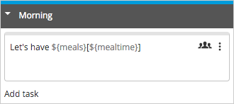
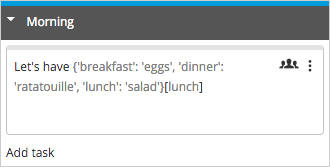
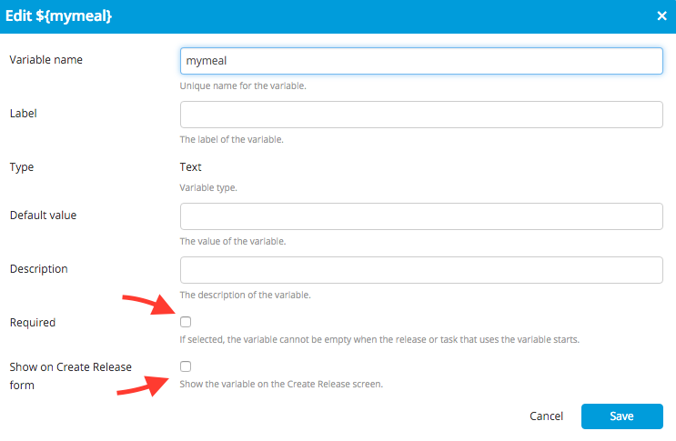

To get a value from a [release variable](/xl-release/how-to/create-release-variables.html) of type key-value map and use the value in a text field, you can add a [Jython Script task](/xl-release/how-to/create-a-jython-script-task.html) that gets the value and stores it in another variable.

Suppose a template contains a variable called `${meals}` of type key-value map. The variable contains:

{:.table .table-striped}
| Key | Value |
| --| ----|
| breakfast | eggs |
| lunch | salad |
| dinner | ratatouille |

Another variable, called `${mealtime}`, can have the value `breakfast`, `lunch`, or `dinner`. This example will show how to get the value `salad` when the `${mealtime}` variable is set to `lunch`.

## Using a script solution

In a script, you can use the following Python syntax to get the value:

	${meals}[$mealtime]

However, using this syntax in a text field does not work because variables are replaced literally in tasks (they are not interpreted).

Instead, you should add a Jython Script task that will get the value from the key-value map and store it in a new variable called `${mymeal}`.

## Add a variable and a script

First, go to the template's [Variables screen](/xl-release/how-to/create-release-variables.html#create-a-release-variable-on-the-variables-screen) and create a variable called `${mymeal}`. Be sure to clear the **Required** and **Show on Create Release form** options.

You can now use `${mymeal}` in tasks without it interfering the creation of a release.

Next, add a Jython Script task called "Set mymeal variable" and move it just before the task that will use the `${mymeal}` variable. The template will look like:

In the Jython Script task, you can read and set variables using a Python dictionary called `releaseVariables`. This is the script in the "Set mymeal variable" task:

    releaseVariables['mymeal'] = ${meals}['${mealtime}']

## Configure security settings

Because the script sets a release variable by modifying `releaseVariables`, you must ensure that the release has the required permissions. In the template, go to the [Properties screen](/xl-release/how-to/configure-release-properties.html) and set **Run script as user** and **Password** to the user name and password of a user that has write permissions on the release.

## Create and start the release

Now, you can [create a release from the template](/xl-release/how-to/start-a-release-from-a-template.html) and start it.

