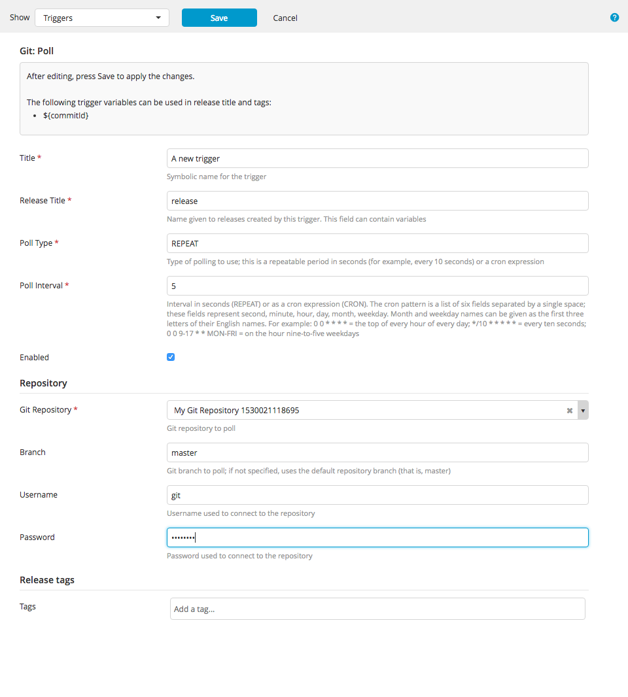

The XL Release Git trigger periodically polls a Git repository and triggers a release when it detects a new commit.

## Features

* Periodically polls a Git repository
* Triggers a release when it detects a new commit

## Set up a Git repository

To set up a Git repository:

1. In XL Release, go to **Settings** > **Shared configuration** and click **Add Repository** under **Git: Repository**.

    **Note:** Prior to XL Release 6.0.0, go to **Settings** > **Configuration**.

2. In the **Title** box, enter the name of the repository.
3. In the **URL** box, enter the address where the server is reachable.
4. In the **Username** and **Password** boxes, enter the server log-in user ID and password.
5. Click **Save** to save the repository.

## Add a Git trigger to a template

To create a Git trigger:

1. Add a trigger to the template, as described in [Create a release trigger](/xl-release/how-to/create-a-release-trigger.html).
2. In the **Git Repository** box, enter the Git repository to poll.
3. In the **Branch** box, optionally enter the Git branch that the trigger should watch.
4. In the **Username** and **Password** boxes, enter the log-in user ID and password to use to connect to the repository (leave them blank if authentication is not required).

    

5. Finish saving the trigger, as described in [Create a release trigger](/xl-release/how-to/create-a-release-trigger.html).

## Output properties

The output of the Git trigger is a **Commit Id**, which corresponds to the SHA1 of the new commit.

## Specific permission

The Git trigger may require an edition of the `XL_RELEASE_SERVER_HOME/conf/script.policy` file. Ensure that the following line is present in the file:

	grant {
	    ...

        permission  java.net.NetPermission "getProxySelector";

	    ...
	};

You must restart the XL Release server after changing the `XL_RELEASE_SERVER_HOME/conf/script.policy` file.
