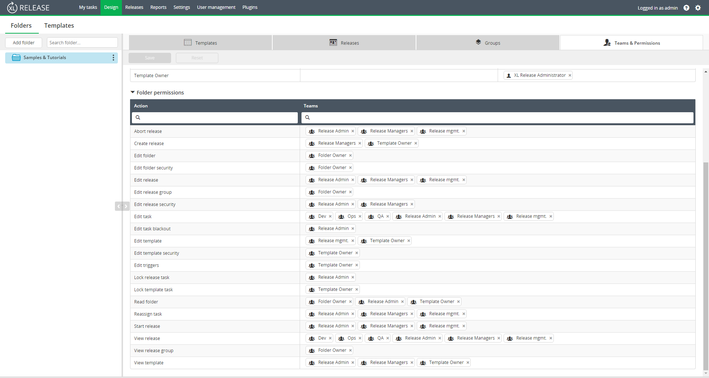

In XL Release 8.0 and later, the release group feature is available. By grouping releases together, you can manage a collection of releases as one group. Releases can be added to multiple release groups, and into multiple folders. The release group feature also provides estimates on when the release group will start and finish, based on the schedule and other tasks that are being executing at the same time.

## Release group overview screen
This screen shows all release groups based on status. From this screen, you can view start and end dates, completion status, duration, and the number of releases per group. You can also edit group details and delete groups.

## Release group flow screen
This screen shows detailed information on the releases that are in a release group. From this screen, you can add and remove releases, view the release group schedule, view planned and estimated completion dates. Selecting a release item in this screen will open the release flow screen for an individual release.

## Release group actions   
Group actions are role based and permissions must be granted to a user or team before they can view, edit, or create release groups.

### Grant release group permissions
1. On the navigation bar, click **Design**.
1. Click **Folders**.
1. Select a folder.
1. From the tab, click **Teams & Permissions**.
1. Under the **Folder permissions** section, add a team name to the right of **View release group** and **Edit release group**.

 **Note:** The edit release group permission is required to create release groups.

 

### Create a new group
1. On the navigation bar, click **Design**.
1. Click **Folders**.
1. Select a folder.
1. From the tab, click **Groups**.
1. Click **New release group**.
1. Enter a group name.
1. Select a start date.
1. Select an end date.
1. Click **Create**.   

**Note:** To view groups that are not active, click **Status** and select the **Planned** checkbox from the drop-down.

### Edit group details
You can edit group details from two locations:

- From the Releases screen:
 1. On the navigation bar, click **Releases**.
 1. Click **Groups**.
 1. On the right of a group, click **Edit**.
 1. Edit group details.
 1. Click **Save**.   
    
- From the Folders screen
 1. On the navigation bar, click **Design**.
 1. Click **Folders**.
 1. Select a folder.
 1. From the tab, click **Groups**.
 1. From the tab, click Groups.
 1. On the right of a group, click **Edit**.
 1. Edit group details.
 1. Click **Save**.    

**Note:** To view groups that are not active, click **Status** and select the **Planned** checkbox from the drop-down.

### Add a release to a group
 1. On the navigation bar, click **Releases**.
 1. On the right of the release, click .
 1. Click **Add to group**.
 1. In the **Group name** field, enter a group name, or select a group by clicking the drop-down arrow.
 1. Click **Add**.

### Add multiple releases to a group
 1. On the navigation bar, click **Design**.
 1. Click **Folders**.
 1. Select a folder.
 1. From the tab, click **Groups**.
 1. Select a group.
 1. Click **Add a release**.
 1. Click **Select all** or select the releases you want to add.
 1. Click **Add**.

 

### Remove a release from a group
 1. On the navigation bar, click **Releases**.
 1. Click **Groups**.
 1. Click the group name.
 1. Beside the release name, click 
 1. Click **Remove from group**.   

### Delete a group
You can delete a group from two locations:

- From the Release screen:
 1. On the navigation bar, click **Releases**.
 1. Click **Groups**.
 1. On the right side of the group, click **Delete**.   
  

- From the Design screen:
 1. On the navigation bar, click **Design**.
 1. Click **Folders**.
 1. Select a folder.
 1. From the tab, click **Groups**.
 1. On the right side of the group, click **Delete**.

### Ordering and displaying groups
Groups are displayed and ordered based on two attributes: **Status** and **Order by**. Both attributes are displayed at the top of all release and group pages.

* To order and display groups based on status: From the **Status** drop-down, select a checkbox, or checkboxes, based on activity or completion status.

* To order groups based on risk or date: Select an option from the **Order by** drop-down.

#### Status types
All release groups display a current status. The status types are as follows:

- **Planned:** No release in a release group has started.
- **In process:** One or more releases in a release group is being executed.
- **Paused:** All releases in a release group have been paused.
- **Failing:** One or more releases in a release group is failing.
- **Failed:** All releases in a release group have failed.
- **Aborted:** All releases in a release group were aborted.
- **Completed:** All releases in a release group were completed.
