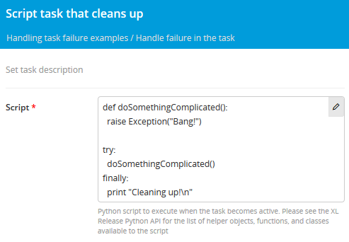
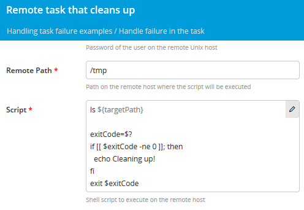
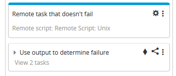
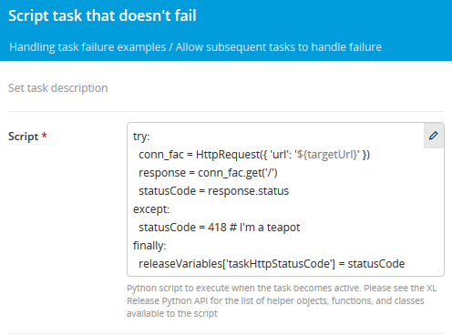
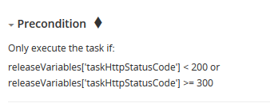
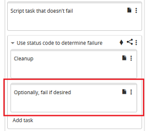
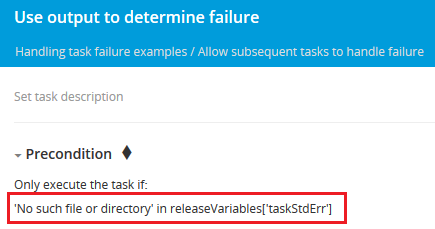
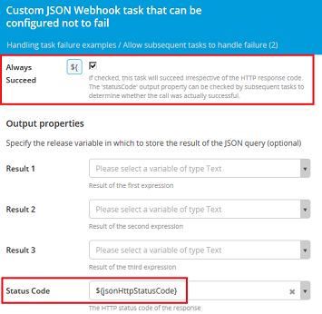
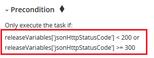

By default, when a task in a release fails, [the release stops](/xl-release/concept/release-life-cycle.html) so you can retry the task, skip the task, or add new tasks to deal with the situation. Alternatively, if the [Abort on failure](/xl-release/how-to/configure-release-properties.html) option is selected, the release immediately aborts if a failure occurs. This is useful for Continuous Integration/Continuous Delivery environments in which a new code commit will fix the problem and start a new release.

These options provide general support for both fully and partially automated release scenarios. However, in some scenarios, you may want to execute certain actions if a task fails; for example, cleaning up resources or notifying a certain team. This topic will discuss two approaches:

* [Handling failure in the task](#handling-failure-in-the-task)
* [Handing failure in a conditional block, based on the task status/output](#handling-failure-in-a-conditional-block)

**Important:** As of XL Release 8.1.0 a new property was added on the task level called **Handling failure**. You can use this to execute a `Jython` script when the task fails its execution or just to skip the task. For more information, see [Task failure handler](/xl-release/how-to/task-failure-handler.html).

The examples shown here are based on a [sample template](https://gist.github.com/xlcommunity/a289a5a766fde13c1614/raw/c407e554521f32d91c8f879cd70bbfb080bed409/handling-task-failure-examples.xlr) that you can download and import. Note that this requires adding a [custom task type](/xl-release/how-to/create-custom-task-types.html), which you can do by [copying the type definition to the `ext` directory](/xl-release/how-to/create-custom-task-types.html#defining-a-custom-task) or by downloading and installing [this community plugin](https://gist.github.com/xlcommunity/a289a5a766fde13c1614/raw/c407e554521f32d91c8f879cd70bbfb080bed409/xlr-acme-webhook-2016-02-20.jar).

## Handling failure in the task

The simplest and most effective way to handle failure in a task is to include the appropriate error-handling logic in the task implementation itself. For example:

This approach allows you to retry the task multiple times without accumulating a backlog of items that need to be cleaned up later. For example, if a task tries to create a user and then create a ticket, you could add a failure handler around the "create ticket" part so you can delete the user if the ticket was not created successfully. That is, instead of this logic:

    newUser = createUser()
    ticket = createTicket(newUser)

You can use this logic:

    newUser = createUser()
    try:
      ticket = createTicket(newUser)
    except:
      deleteUser(newUser)
      sys.exit(1)

You can use this approach with [Remote Script tasks](/xl-release/how-to/remote-script-plugin.html), [Jython Script tasks](/xl-release/how-to/create-a-jython-script-task.html), and [custom tasks](/xl-release/how-to/create-custom-task-types.html). For example, here is a Remote Script task:

## Handling failure in a conditional block

In cases where the task implementer does not necessarily know which actions need to be taken when a task fails, you can add a group immediately following the task with a condition that ensures that it only executes if the task *does not* succeed. For example:

In this case, the task must:

* Complete its executing without triggering a task failure. That is, a Remote Script task must exit with a non-zero exit code, and a Jython Script task must not throw an exception.

* Set the value of a variable to an appropriate value for the conditional group to determine whether it should execute. In some cases, this may happen by default; for example, there might be a standard output or error. But for HTTP requests, for example, you may want to expose the response code for this purpose.

### Sample Jython Script task

This is an example of a Jython Script task that succeeds and [sets a variable](/xl-release/how-to/create-a-script-task.html) with the response code of the HTTP request it executes.

The associated group then checks the variable in its [precondition](/xl-release/how-to/set-a-precondition-on-a-task.html).

If you want the release to fail after the cleanup operation is done, add a task that fails to the end of the conditional group.

### Sample Remote Script Task

For Remote Script tasks, you can usually determine whether a task succeeded by looking at the standard output or standard error, which are available as variables.

For remote tasks, it's often possible to determine whether a task did not succeed by looking at the standard out or standard error, which are already available as variables. Note that the remote script is configured to always return exit code 0, so the XL Release task will not fail:

Note that in this example, the remote script is configured to always return exit code 0, so the XL Release task will not fail.

### Sample custom Webhook task

This approach can be used with other task types, with some customizations. For example, this `sythetic.xml` code extends the [Webhook task type](/xl-release/how-to/create-a-webhook-task.html) with a type that always succeeds and provides the HTTP response code as an output variable that can be used in subsequent tasks.


<type type="acme.JsonWebhook" extends="webhook.JsonWebhook">
    ...
    <property name="statusCode" kind="integer" category="output" required="false"
      description="The HTTP status code of the response" />
    <property name="alwaysSucceed" kind="boolean" category="input"
      required="false" default="false" description="If checked, this task will
        succeed irrespective of the HTTP response code. The 'statusCode' output
        property can be checked by subsequent tasks to determine whether the call
        was actually successful." />
</type>


This also requires minor changes to the implementation:

Then, you can use the modified Webhook task with a group that checks the status code to determine whether the task executed successfully.

The [type definition](https://gist.github.com/xlcommunity/a289a5a766fde13c1614#file-synthetic-snippet-xml) and [task implementation](https://gist.github.com/xlcommunity/a289a5a766fde13c1614#file-jsonwebhook-py) are available as part of the [Gist](https://gist.github.com/xlcommunity/a289a5a766fde13c1614) mentioned above.

**Important:** The code provided in the [Gist](https://gist.github.com/xlcommunity/a289a5a766fde13c1614) is sample code that is not officially supported by XebiaLabs. If you have questions, please contact the [XebiaLabs support team](https://support.xebialabs.com).
