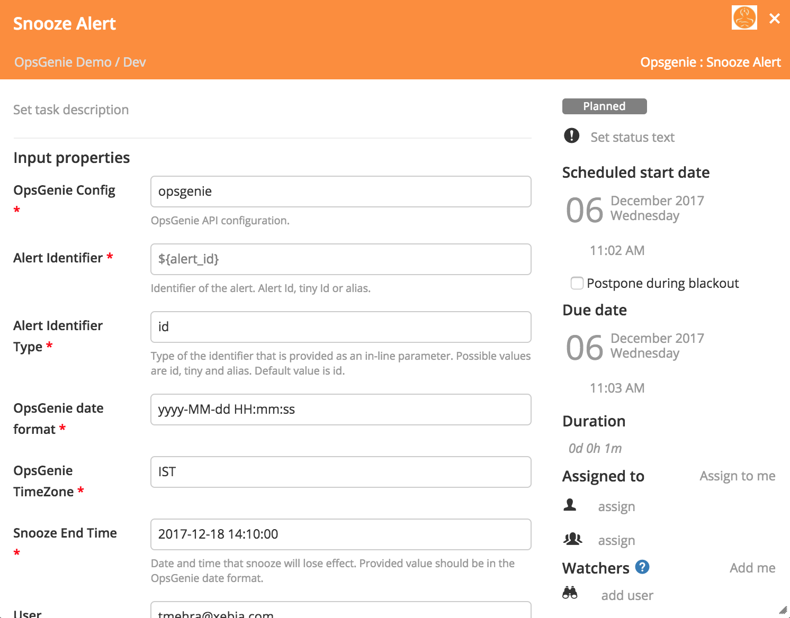
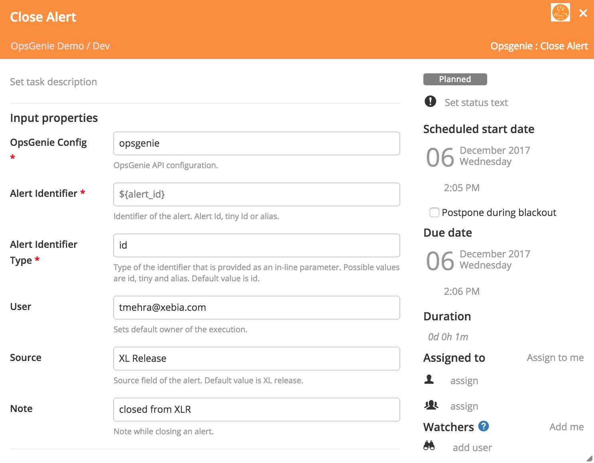
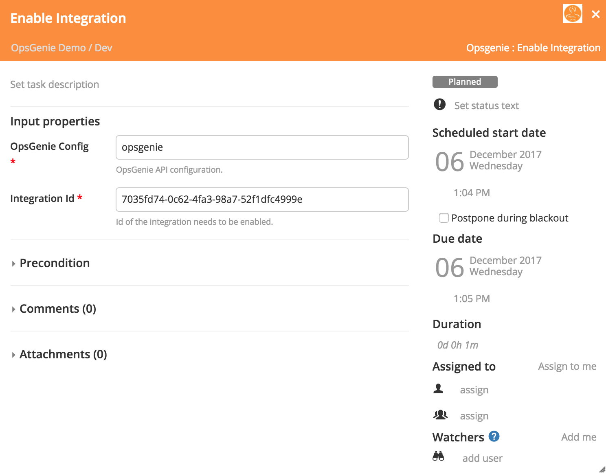

The XL Release OpsGenie plugin allows you to use XL Release with [OpsGenie](https://www.opsgenie.com/) to generate alerts with all the supporting information to the responsible teams and people from within the release pipeline.

## Features of the OpsGenie integration

* In a typical release process, it is necessary to inform the correct teams for the task failures and for application server issues.
* With the XL Release OpsGenie plugin, alerts with all the supporting information are delivered to the teams involved in the release process. This enables the users to assess the issues and take appropriate actions rapidly.
* The XL Release OpsGenie plugin helps you specify the create, snooze, and close alerts tasks in the release pipeline. You can also create a task in XL Release to execute any custom action on the alerts.
* The plugin provides the functionality to disable or enable integrations in OpsGenie for the deployment downtime. For example: if you do not want the *Nagios* application monitoring tool to generate alerts in OpsGenie at the time of application deployment, create a task to disable *Nagios* integration before the deployment. You can enable the integration after the deployment is completed.

### List of actions

* Create, snooze, and close alerts in OpsGenie
* Execute custom actions on alerts in OpsGenie
* Disable or enable integrations in OpsGenie

Download a sample of the [ReleaseFile](/xl-release/how-to/sample-scripts/OpsGenie-demo-Releasefile.groovy) for a demo of the OpsGenie XL Release plugin.

## Requirements

* A valid [OpsGenie](https://www.opsgenie.com/) subscription and a user with admin rights.
* [XL Release 7.5](/xl-release/concept/requirements-for-installing-xl-release.html) or later.
* The XL Release OpsGenie plugin

## Setup

* Download the latest version of the XL Release OpsGenie plugin and copy it to the `XL_RELEASE_SERVER_HOME/plugins` directory.
* Start the XL Release server. You will see the available new [task types](/xl-release/concept/types-of-tasks-in-xl-release.html):

    

## Specify OpsGenie API key

* Specify the OpsGenie API key to make API calls to OpsGenie.
* Specify proxy settings if applicable.
* Create multiple configurations if the API keys are limited to specific teams.

### Steps to generate API key in OpsGenie**

1. Log in to OpsGenie as an admin user.
1. Go to integrations and search for XebiaLabs XL Release integration in the list.
1. Create XL Release integration and copy the generated API key.
1. In XL Release, go to **Settings** > **Shared configuration**.
1. Add a new OpsGenie config and provide a title.
1. In the API Key property, copy the API key from the OpsGenie integration.

## Create an alert

The **OpsGenie: Create Alert** task allows you to create an alert in OpsGenie by specifying the alert message, recipient teams, priority, and other information.

*Usage guideline:* When the deployment task fails in the release pipeline, create an alert in OpsGenie for the release team.

### Task Properties

* OpsGenie Config: Select the OpsGenie config created in **Shared configuration**.
* Message: The message of the alert.
* Alias: The user defined identifier of the alert.
* Description: The description field of the alert that is generally used to provide a detailed information about the alert.
* Teams: The teams where the alert will be routed to send notifications. If the API Key belongs to a team integration, this field will be overwritten with the owner team. Either the ID or the name of each team should be provided.
* Recipients: User, group, schedule, or escalation names define which users will receive the notifications of the alert. If the recipients field is used when an alert is getting created, the recipients field supersedes the team's assignment. The key is the ID or the name, the value is type of recipient (example: 'user' or 'team').
* Actions: Custom actions that will be available for the alert.
* Tags: The tags of the alert.
* Entity: The entity field of the alert that is generally used to specify which domain the alert is related to.
* Priority: Priority level of the alert. Possible values are P1, P2, P3, P4, and P5. The default value is P3.
* User: Displays the name of the request owner.
* Note: Additional note that will be added while creating the alert.

## Snooze an alert

The **OpsGenie: Snooze Alert** task allows you to snooze an alert in OpsGenie by specifying the time zone and snooze end time in the task.

*Usage guideline:* When an alert is triggered but a release is not yet finished, you can snooze the alert a period of time.

### Task Properties

* OpsGenie Config: Select the OpsGenie config created in **Shared configuration**.
* Alert Identifier: The identifier of the alert. The input can be the alert ID, tiny ID, or the alias.
* Alert Identifier Type: The type of the identifier that is provided as an in-line parameter. Possible values are ID, tiny, and alias. The default value is ID.
* OpsGenie date format: The date format for the snooze end date. The default is `yyyy-MM-dd HH:mm:ss`.
* OpsGenie TimeZone: The OpsGenie Time Zone for snooze end date. The default is GMT.
* Snooze End Time: The date and time when snooze will lose effect. The provided value should be in the OpsGenie date format.
* Snooze Time in minutes: Alert will be snoozed for a specified number of minutes. This property supersedes the End time property, if both are specified.

## Execute Custom Action on alert

The **OpsGenie: Custom Action Alert** task executes a custom action on alert by specifying the alert ID or alias and the action name in the task.

*Usage guideline:* When you want to execute a custom script from an alert action to retry a deployment in XL Deploy.

### Task Properties

* OpsGenie Config: Select the OpsGenie config created in shared configuration.
* Alert Identifier: Identifier of the alert. Takes alert Id, tiny Id or alias as input.
* Alert Identifier Type: Type of the identifier that is provided as an in-line parameter. Possible values are id, tiny and alias. Default value is id.
* Custom action: Name of the custom action to execute.

## Close an alert

The **OpsGenie: Close Alert** task closes an alert in OpsGenie by specifying the alert ID or alias of an alert in the task.

*Usage guideline:* When the deployment is successfully completed and you want to close the generated alert.

### Task Properties

* OpsGenie Config: Select the OpsGenie config created in **Shared configuration**.
* Alert Identifier: The identifier of the alert. The input can be the alert ID, tiny ID, or the alias.
* Alert Identifier Type: The type of the identifier that is provided as an in-line parameter. Possible values are ID, tiny, and alias. The default value is ID.

## Delete an alert

The **OpsGenie: Delete Alert** task allows you to delete an alert in OpsGenie by specifying the alert ID or alias of an alert in the task.

*Usage guideline:* When the generated alerts are no longer required to exist in OpsGenie, use the delete task to remove the alerts.

### Task Properties

* OpsGenie Config: Select the OpsGenie config created in **Shared configuration**.
* Alert Identifier: The identifier of the alert. The input can be the alert ID, tiny ID, or the alias.
* Alert Identifier Type: The type of the identifier that is provided as an in-line parameter. Possible values are ID, tiny, and alias. The default value is ID.

## Enable Integration in OpsGenie

The **OpsGenie: Enable Integration** task enables an integration in OpsGenie by specifying the integration ID in the task.

*Usage guideline:* After the successful deployment, you can re-enable the integrations in OpsGenie.

### Task Properties

* OpsGenie Config: Select the OpsGenie config created in **Shared configuration**.
* Integration ID: The ID of the integration needs to be enabled.

## Disable Integration in OpsGenie

The **OpsGenie: Disable Integration** task allows you to disable an integration in OpsGenie by specifying the integration ID the task.

*Usage guideline:* Before starting the release, you can disable integrations which may generate alerts when the servers are down such as the *Nagios* monitoring tools.

### Task Properties

* OpsGenie Config: Select the OpsGenie config created in **Shared configuration**.
* Integration ID: The ID of the integration needs to be enabled.

