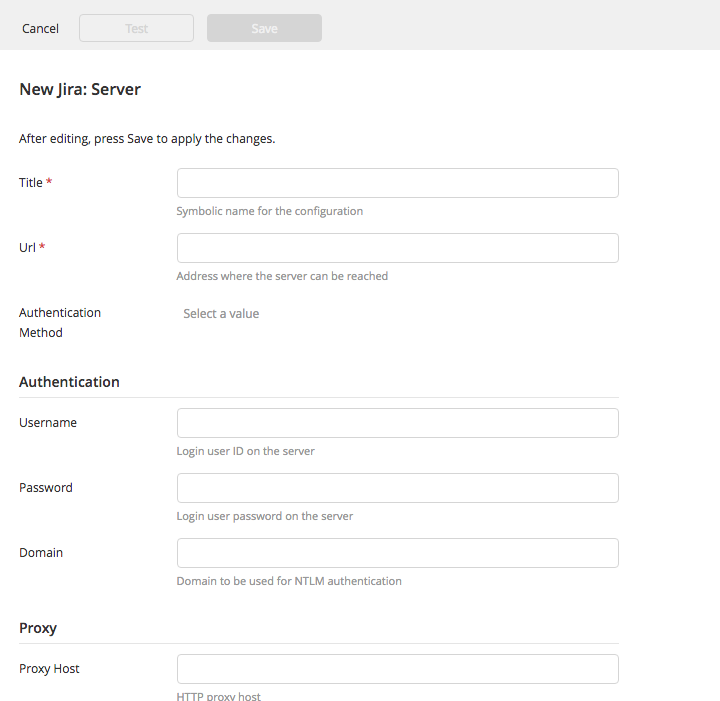
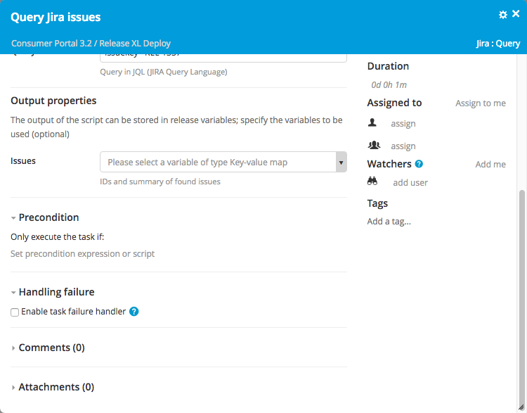
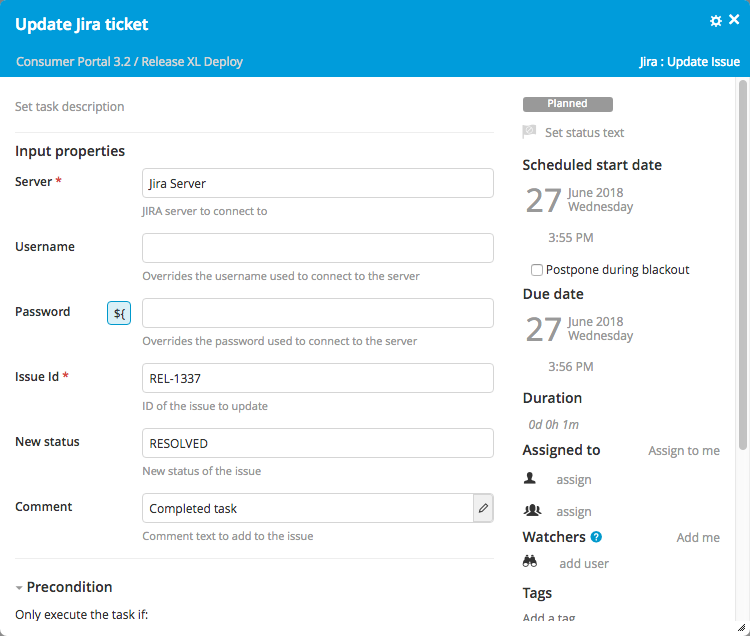
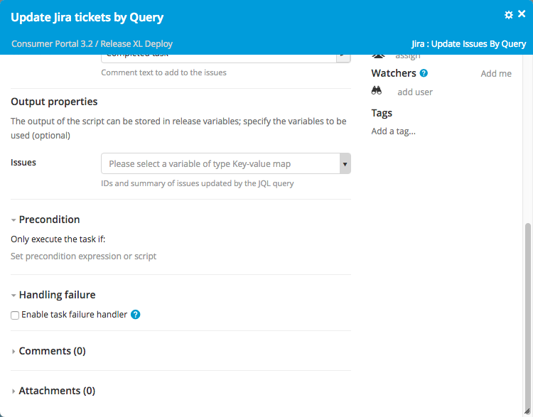

JIRA tasks allow XL Release to interact with an [Atlassian JIRA](https://www.atlassian.com/software/jira) server. The following JIRA task types are available:

* **Jira: Create Issue**: Create a new JIRA issue
* **Jira: Query**: Query JIRA using [JQL](https://confluence.atlassian.com/jira/advanced-searching-179442050.html) (available in XL Release 4.8.0 and later)
* **Jira: Update Issue**: Update a single JIRA issue to change its status or post a comment
* **Jira: Update Issues**: Update multiple JIRA issues (available in XL Release 4.8.0 and later)
* **Jira: Update Issues by Query**: Update JIRA issues based on a query (available in XL Release 4.8.0 and later)

See also the tutorial [Using variables to revise a JIRA issue list](/xl-release/how-to/tutorial-using-variables-to-revise-a-jira-issue-list.html).

In the [release flow editor](/xl-release/how-to/using-the-release-flow-editor.html), JIRA tasks have a blue border.

## Features

* Create a new JIRA issue
* Query JIRA for issues
* Update one or more existing JIRA issues
* Update JIRA issues based on a query

## Set up a JIRA server

To set up a JIRA server:

1. In XL Release, go to **Settings** > **Shared configuration** and click **Add Repository** under **Jira: Server**.

    **Note:** Prior to XL Release 6.0.0, go to **Settings** > **Configuration**.

2. In the **Title** box, enter the name of the JIRA server. This name will appear in JIRA tasks.
3. In the **URL** box, enter the URL of the JIRA server.
4. In the **Username** and **Password** boxes, enter the server log-in user ID and password.
5. Click **Save** to save the server.

    

## Create issue

The **Jira: Create Issue** task type creates an issue in JIRA.

The following properties are available:

* **Server**: The JIRA server that will be used
* **Username** and **Password**: The server log-in user ID and password; if set, these will override the credentials defined in the JIRA server configuration
* **Project**: The JIRA project name
* **Title**: The issue title
* **Description**: The issue description
* **Issue Type**: The issue type (for example, bug or improvement); refer to the [JIRA issue type documentation](https://confluence.atlassian.com/display/AOD/What+is+an+Issue#WhatisanIssue-IssueType) for a complete list

The output of the task is `issueId`, the ID of the JIRA issue that was created.

## Query

The **Jira: Query** task type executes a [JQL](https://confluence.atlassian.com/jira/advanced-searching-179442050.html) query on a JIRA server to retrieve a list of issues and their summaries (titles). It is supported in XL Release 4.8.0 and later.

The following properties are available:

* **Query**: A JQL query that finds the issues that will be updated in this task

The output of the task is `issues`, a key-value map that contains the issue IDs (keys) and summaries (values) of the issues that were found. When the output is stored in a variable, you can use the data later in a **Jira: Update Issues** task.

## Update issue

The **Jira: Update Issue** task type updates a single issue in JIRA.

The following properties are available:

* **Server**: The JIRA server that will be used
* **Username** and **Password**: The server log-in user ID and password; if set, these will override the credentials defined in the JIRA server configuration
* **Issue Id**: The ID of the issue to update
* **New Status**: The new status of the issue; refer to the [JIRA Workflow documentation](https://confluence.atlassian.com/display/JIRA/What+is+Workflow) for a complete list
* **Comment**: The text of a comment to add to the issue

## Update issues

The **Jira: Update Issues** task type updates multiple issues in JIRA. It is supported in XL Release 4.8.0 and later.

The following properties are available:

* **Server**: The JIRA server that will be used
* **Username** and **Password**: The server log-in user ID and password; if set, these will override the credentials defined in the JIRA server configuration
* **Issues**: A key-value map that contains the issue IDs (keys) and summaries (values) of each issue.

    The Jira: Query task type produces a key-value map that can be stored in a variable; you can then use that variable as input for a Jira: Update Issues task.

    The issue summaries (the values in the key-value map) are only required if you want to update them in JIRA (using the **Update Summaries** option).

* **New Status**: The new status of the issues; refer to the [JIRA Workflow documentation](https://confluence.atlassian.com/display/JIRA/What+is+Workflow) for a complete list
* **Comment**: The text of a comment to add to the issue
* **Update Summaries**: Indicates whether to change the issue summaries in JIRA

## Update issues by query

The **Jira: Update Issues by Query** task type updates issues that are located by a [JQL](https://confluence.atlassian.com/jira/advanced-searching-179442050.html) query. It is supported in XL Release 4.8.0 and later.

The following properties are available:

* **Server**: The JIRA server that will be used
* **Username** and **Password**: The server log-in user ID and password; if set, these will override the credentials defined in the JIRA server configuration
* **Query**: A JQL query that finds the issues that will be updated in this task
* **New Status**: The new status of the issues; refer to the [JIRA Workflow documentation](https://confluence.atlassian.com/display/JIRA/What+is+Workflow) for a complete list
* **Comment**: The text of a comment to add to the issues

The output of the task is `issues`, a key-value map that contains the issue IDs (keys) and summaries (values) of the issues that were updated.

