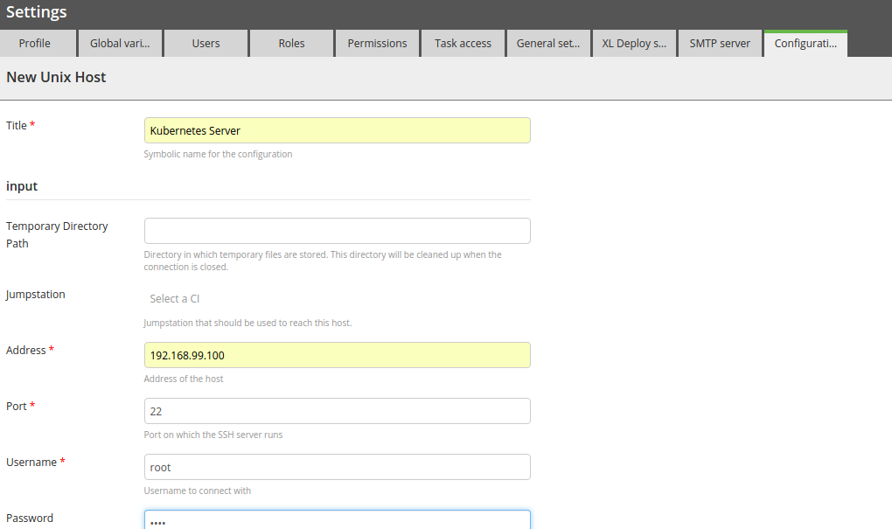
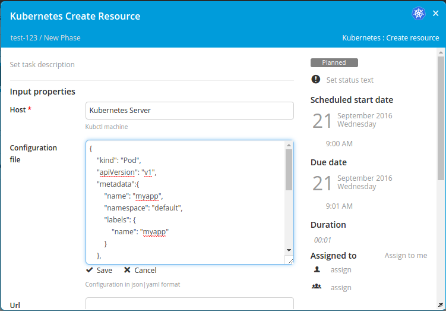
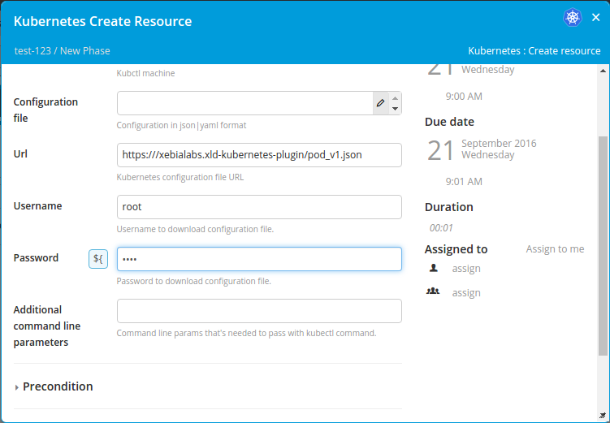

The XL Release [Kubernetes](http://kubernetes.io/) plugin allows XL Release to work with resources on a Kubernetes host. It includes the following task types:

* **Kubernetes: Create resource**
* **Kubernetes: Wait**
* **Kubernetes: Remove resource**

In the [release flow editor](/xl-release/how-to/using-the-release-flow-editor.html), Kubernetes tasks have a blue border.

## Features

* Create a new Kubernetes resource
* Remove a Kubernetes resource
* Wait for a created resource to be in a running state

## Requirements

The Kubernetes plugin requires the XL Release [Remoting plugin](/xl-release/how-to/remoting-plugin.html) to be installed.

## Set up a Kubernetes server

To set up a connection to a Unix server running Kubernetes:

1. In XL Release, go to **Settings** > **Configuration** and click **Add Unix Host**.
2. In the **Address** box, enter the IP address or host name of the remote machine running the Kubernetes server.
3. In the **Port** box, enter the SSH port of the remote machine.
4. In the **Username** and **Password** boxes, specify the user name and password of the SSH user that XL Release should use when connecting to the remote machine.
5. In the **Sudo Username** box, enter the user name of the `sudo` user on the remote machine (for example, `root`).

    

## Create Resource task type

The **Kubernetes: Create Resource** task type creates a resource in Kubernetes. It requires you to specify a configuration in JSON format. You can specify the configuration:

* By providing JSON in the task
* By providing a URL to a JSON file

You can enter the JSON configuration as plain text in the **Configuration file** box:

Or provide a URL for the configuration file in the **Url** box. If the URL is secure, you must also provide credentials in the **Username** and **Password** boxes.

## Wait task type

You can use the **Kubernetes: Wait** task type to add a task that will execute a command on the Kubernetes server to determine whether the created resource is in a running state. For example, a typical wait command is:

    kubectl describe pods/<name_of_the_pod>

In the **Pattern** box, you can specify a regular expression that should match the output of the specified command. When the output matches the regular expression, the wait step succeeds and the release moves to the next task.

## Remove Resource task type

The **Kubernetes: Remove Resource** task type destroys a resource in Kubernetes. It requires you to specify a configuration in JSON format. As in the [Create Resource task type](#create-resource-task-type), you can enter the JSON in the task or provide a URL to a configuration file.
