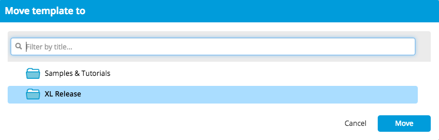

XL Release 6.0.0 introduced [folders](/xl-release/how-to/manage-templates-and-releases-using-folders.html), which allow you to organize related templates and releases. This topic describes how you can migrate existing templates from earlier versions of XL Release into folders. It shows an example in which all templates related to releasing the XL Release product will be moved to a folder called *XL Release*.

## Step 1 Create the folder

First, create the folder. Go to **Design > Folders** to get an overview of the current folders.

Click **New folder** and create a top-level folder called *XL Release*. You need the *Create top level folders* [global permission](/xl-release/how-to/configure-permissions.html) to do this; if the **New folder** button is disabled when no folder is selected, ensure that your [global role](/xl-release/how-to/configure-roles.html) has the permission.

Click the folder to open it. You will see that it is empty.

## Step 2 Set up folder permissions

Go to the **Permission** tab to set up access to the folder.

When you create a folder, XL Release gives it three default teams and puts you in each team as the only member. You can think of a "team" as a local role that only applies to the folder and to the releases and templates that are in it. Note that _all_ templates and releases in a folder will have the security settings that are defined on the folder.

The default teams are:

* **Folder owner**: For XL Release admins who require access to administrative tasks on the folder
* **Template owner**: For template designers
* **Release Admin**: For the release managers

At this point, you should define who has access to what. For example, assume that you have the following global roles:

* **Power users** manage the XL Release server instance
* **Team Toad** develops the XL Release product and manages the release process
* **Technical writers** write the documentation and release notes
* **Users** everybody in the organization

An easy configuration would be:

This is enough to get started. The teams will be expanded as templates are moved into the folder.

## Step 3 Move the templates

To view a list of all templates, go to **Design > Templates**. It contains templates that are stored in a folder and templates that have not been moved to a folder yet. Use the filter box to find the templates you are interested in.

Templates that are already in a folder will have the folder name under their title; for example, the "Configure XL Release" template is in the "Samples & Tutorials" folder. Find the template that you want to move and click **Move**. XL Deploy will ask you for the destination folder.

After selecting the folder, you can choose how to handle the permissions.

Select **Add teams and permissions...**. This will copy the teams that were defined on the template to the folder, adding any new teams and merging team members from the template into the teams that are already defined on the folder. This option helps you to populate the teams on the folder.

If you choose **Remove teams and permissions...**, the teams on the template will be discarded and the teams on the folder will not be changed. Use this option if you have already set up teams on the folder and don't want them to change.

## Step 4 Verify the results

Go to the folder by clicking its name under the template in the template overview. Go to the **Teams & Permissions** tab and you will see which teams were added.

As you can see, several teams have been added and the permissions are updated accordingly.

## Step 5 Continue to move templates

Now continue to move templates with the **Add teams and permissions...** option. When you are done, review the teams and permissions on the folder again. It will give you a consolidated view of all teams. This will apply to all templates in the folder.

For example, assume that "Bob Mediano" (shown in the screenshots above) has left the company. You can remove him from the "Dev" team and the change will apply to all templates. (Don't forget to click **Save**.) It is also good practice to review that all permissions are assigned to the appropriate teams. Make any permission changes that are needed, and you will be ready for future future releases that will be started from templates in the folder.

## Working with nested folders

In XL Release, you can nest folders. For example, you can set up a structure with a parent folder named **Products** that contains **XL Deploy** and **XL Release** subfolders.

It is important to realize that by default, folders inherit permissions from the parent folder. So in this case, the **XL Release** folder takes its permissions from the **Products** folder.

In this case, when you move a template into the **XL Release** folder and you choose the **Add teams and permissions...** option, the teams and permissions are actually added to the **Products** folder.

If you don't want this to happen, clear the **Inherit teams and permissions..** option on the **Teams & Permissions** tab of the subfolder to which you are moving the templates. When this option is disabled, all teams and permissions are defined directly on the folder. Changes to the teams and permissions of the parent folder do not apply to the subfolder, so you have to decide what works best for you.
