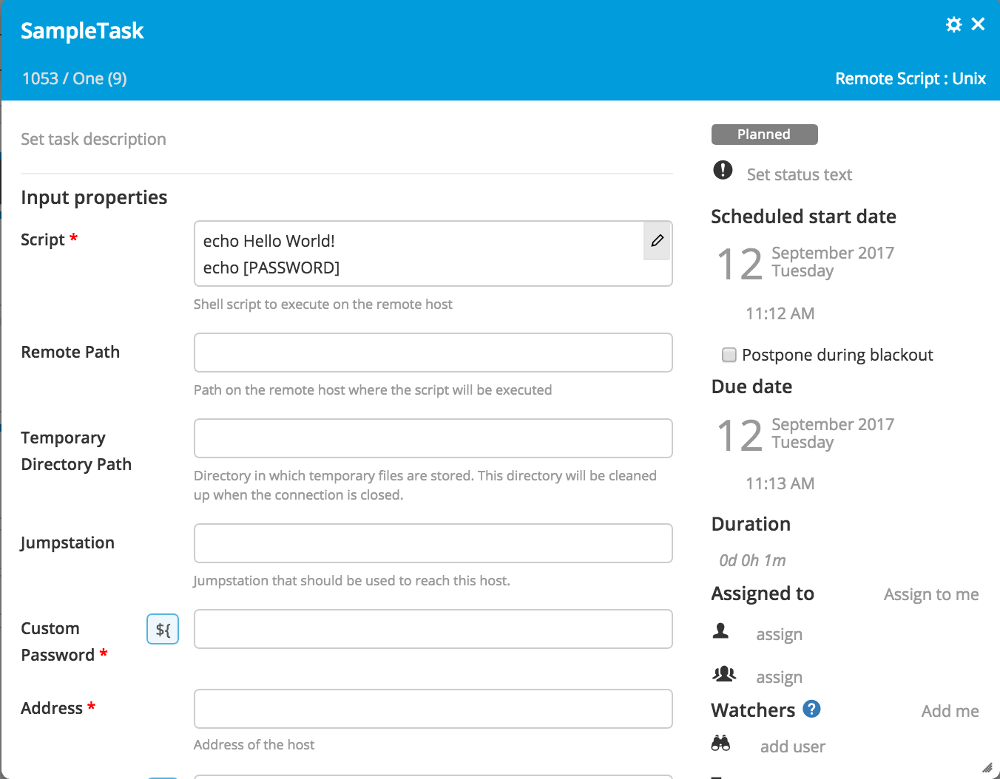
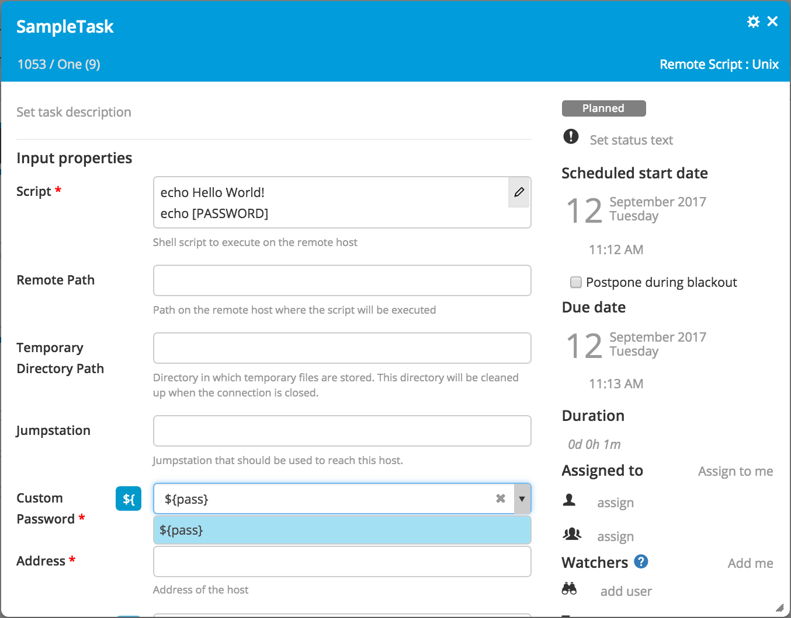

XL Release prevents the improper usage of passwords by allowing password type variables to be used only in password fields.

You can use and mask password in custom script tasks like the [Jenkins task](/xl-release/how-to/create-a-jenkins-task.html), [Jython Script task](/xl-release/how-to/create-a-jython-script-task.html), or the [Remote Script task](/xl-release/how-to/remote-script-plugin.html).

Currently, if you try to use a password type variable in a non-password field of a task, the task fails and the error is shown: "Ensure that global variables are defined, password variables are only used in password fields, and other variables are only used in non-password fields.".

This topic describes a simple method to use a password in a custom Remote Script task.

## Adding a password variable and a token

* In the `synthetic.xml` file, modify an existing task type. This code snippet extends the Remote Script task type by adding a new `customPassword` property and changes the location of the python script of the Remote Script task.

        <type-modification type="remoteScript.RemoteScript">
            <property name="customPassword" kind="string" password="true" category="input"/>
            <property name="scriptLocation" hidden="true" default="remoteScript/MyRemoteScript.py" />
        </type-modification>

**Note:** After every change to the `synthetic.xml` file, make sure you restart your XL Release server.

* Add a new Remote Script task
* In your custom remote script, define a token for the password you want to use (For example `[PASSWORD]`).

* In the new **Custom Password** field, switch to variable and then select a password type variable from the drop down list.

* Create the new Python script file, for example `MyRemoteScript.py`, and save it in `XL_RELEASE_SERVER_HOME/ext/remoteScript`.

For the Remote Script task, go to `XL_RELEASE_SERVER_HOME/lib` and in the `xlr-remotescript-plugin` file you can find the `remoteScript` folder containing the `RemoteScriptWrapper.py` file. Copy the contents of the python file to the new `MyRemoteScript.py` file.

* To replace the `[PASSWORD]` token in your custom script from the Remote Script task with the value in the `customPassword` variable, add the following code in the `MyRemoteScript.py` file:

      import string
      updatedScript = string.replace(script, '[PASSWORD]', customPassword)
      task.pythonScript.setProperty('script', updatedScript)  

* To mask the value of the password add this line in the `MyRemoteScript.py` file:

      output = string.replace(output, customPassword, '********')

* The sample `MyRemoteScript.py` file:

      import sys
      from com.xebialabs.xlrelease.plugin.overthere import RemoteScript

      # Replace password in script
      import string
      updatedScript = string.replace(script, '[PASSWORD]', customPassword)
      task.pythonScript.setProperty('script', updatedScript)

      # Execute script
      script = RemoteScript(task.pythonScript)
      exitCode = script.execute()

      output = script.getStdout()
      err = script.getStderr()

      # Mask password
      output = string.replace(output, customPassword, '********')

      if (exitCode == 0):
          print output
      else:
          print "Exit code "
          print exitCode
          print
          print "#### Output:"
          print output

          print "#### Error stream:"
          print err
          print
          print "----"

          sys.exit(exitCode)        

* Open the Remote Script task and fill in all the required fields. Create a new release, specify the password you want to use, and then start the release. You will see the output of the script task:    

