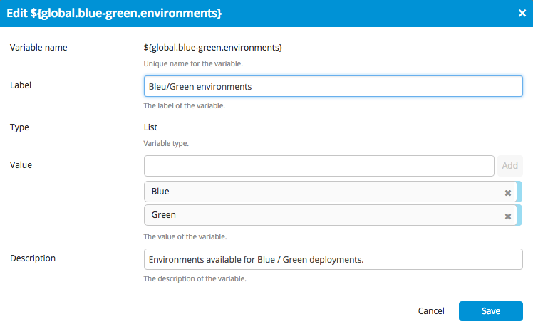
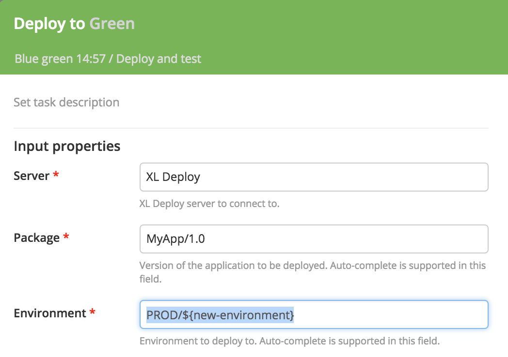

This guide explains how to perform ["Blue/Green" deployments](http://martinfowler.com/bliki/BlueGreenDeployment.html) using XL Release and XL Deploy.

Blue-green deployment is a pattern in which identical production environments known as Blue and Green are maintained, one of which is live at all times.
If the Blue is the live environment, applications or features are deployed to and tested on the non-live Green environment before user traffic is diverted to it.

If it is necessary to roll back the release in the Green environment, you can route user traffic back to the Blue environment.

When the Green environment is stable, the Blue environment can be retired and is ready to be updated in the next iteration, where it will take the role of the Green environment of this example.

This guide has the following parts:

1. Defining the pattern in XL Release.
2. Defining the environments in XL Deploy.
3. Combining the defined components and setting up the process.

## Defining the Blue/Green pattern in XL Release

With XL Release you can define your release process in simple steps and create a process prototype that is immediately usable. With advance knowledge of the process, you can refine the defined release flow in XL Release and integrate your toolchain.

The first step is to create a sketch of the process. This gives you a high-level overview of the Blue/Green deployment pattern.

This XL Release template shows the basic steps. You can create it by adding manual tasks as placeholders. XL Deploy will be used this example, so XL Deploy stub tasks are added.

This high level sketch is the starting point of your Blue/Green deployment process. The primary purpose is to be detailed description of Blue/Green deployments, but can be used as a workflow model.

_The Blue/Green Release deployment template can be found in the **Samples & Tutorials** folder (XL Release 8.0 and higher)_

There are four phases:

#### 1. **Select new environment**

This is a preparation phase to make sure that the software is deployed to the correct environment.

 * **What is currently running?**. Determine the environment that is currently live ('Blue') and deduce the new environment ('Green'). Because 'Blue' and 'Green' can switch roles, in this example the term 'current live environment' is used for 'Blue' and 'new environment' for 'Green' .

 * **Confirm new environment**. The release manager confirms that you will deploy to the right environment. This is modeled in XL Release using a User Input Task.

#### 2. **Deploy and test**

You are ready to deploy the new application version to the environment that is not in use.

 * **Deploy to new environment**. XL Deploy handles the deployment of the new version to the environment that is not currently live. The [XL Deploy task in XL Release](/xl-release/how-to/xld-plugin.html) handles the communication with the XL Deploy server.

 * **Run tests**. In the sketch, this is modeled as a manual activity. This allows you to run the template without having all the integrations in place. At a later time this task can be replaced with an automated task that integrates with a testing tool.

 * **OK to switch?** This is a *gate* in the process where the release manager confirms that you can proceed to bring the new environment ('Green') live.

#### 3. **Switch to live**

After the deployment is running and is fully tested, you can make the switch.

* **Reconfigure load balancer**. You must manually execute this step and mark this task as done in XL Release before the process continues. At a later time you can replace it with an automated integration.

* **Update registry with live environment**. Remember which environment is currently live to know the next time you will run this template.

* **Send notification**. Announce the availability of the new features.

## Refine the process

Set up XL Deploy, prepare the environments, and link everything together in XL Release using variables to communicate between tasks.

### XL Deploy setup

In XL Deploy, you will have two nearly identical environments: 'Blue' and 'Green'.

In this example, they are located in the 'PROD' folder.

In XL Release, [add an XL Deploy Server item](/xl-release/how-to/xld-plugin.html#configure-xl-deploy-server-shared-configuration) under Shared Configuration and point it to your XL Deploy installation.

### Variables in XL Release

Define the following variables in XL Release that maintain the state of the Blue/Green process.

* A [global variable](https://docs.xebialabs.com/xl-release/how-to/configure-global-variables.html) `${global.blue-green.environments}`. This is the list of available environments. This list will be used by various other variables. Configure the list of environments once to create a global variable for it. It is a variable of type `List` that has two values: 'Blue' and 'Green', corresponding to the names of the environment in XL Deploy.

* A global variable `${global.blue-green.live-environment}`. Use a global variable as a registry of the currently live environment. This variable can have two values: 'Blue' or 'Green'. It is modeled as a variable of type `ListBox` and you link it to the list of environments you created earlier:

In the same fashion, we maintain the version of the application in the global variable `${global.blue-green.live-version}`.

* [Release variable](/xl-release/how-to/create-release-variables.html) `${new-environment}` is the environment you deploy to. It is modeled as a `ListBox` that links to the list of available environments in `${global.bluegreen-environments}`. The actual value of this variable is determined during the release process and are not filled in by the user. This is why you must uncheck the option **Show on Create release form**.

* Release variables `${app}` and `${version}`. The version of the application to deploy is filled in when the release process starts and is passed to XL Deploy to indicate which version to deploy. The values of these variables are filled in by the release manager when the release starts. This is why the option `Show en Create release form` should be enabled.

Use these variables in the release flow. Here are some examples of tasks using the variable.

In the **What is currently live?** task, use a simple script to determine the new environment:

	if globalVariables['global.live-environment'] == 'Blue':
	    releaseVariables['new-environment'] = 'Green'
	else
	    releaseVariables['new-environment'] = 'Blue'

The User Input task **Confirm new environment** confirms the environments with the release manager. The Release manager can override this choice by selecting another value from the drop down. You can use the variables in the description to render a helpful message.

The **Deploy** task takes the variable to determine which environment to deploy to.

When the deployment was successful, the registry of what is running is updated by setting the global variables in a the Script task **Update registry with live environment**.

	globalVariables['global.blue-green.live-environment'] = '${new-environment}'
	globalVariables['global.blue-green.live-version'] = '${application}/${version}'

### Users and Teams in XL Release

To run the scripts with proper permissions, make sure the **Run automated tasks as user** is set in the template properties page. This user needs the **Edit global variables** global permission.

You should create teams and assign them to the appropriate tasks. For example, you can assign each task to the Release admin team. This will make it easier to run the examples. The easiest way to do this is to do a bulk edit from the table view:

## Running the release

You can now to run the release. Create the release and fill in the values for the application name and version. These should match the application name and version as defined in XL Deploy.

When the release reaches the task, enter the environment to use:

The correct deployment will be triggered in XL Deploy.

