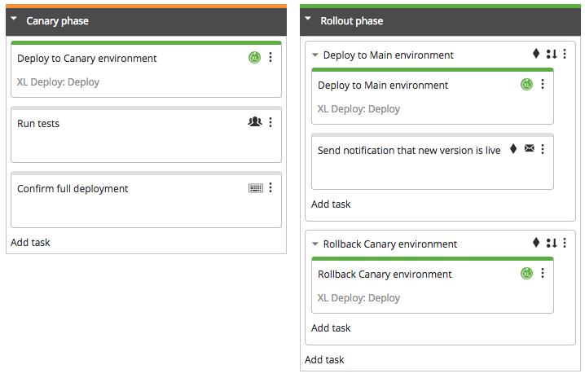
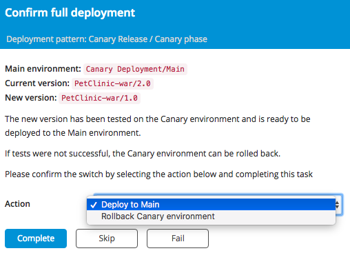
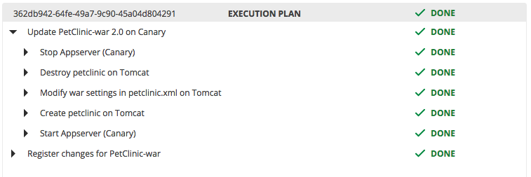

This guide explains how to perform the [Canary Release deployment pattern](https://martinfowler.com/bliki/CanaryRelease.html) using XL Release and XL Deploy.

The Canary Release deployment pattern is a pattern where a small subset on your production environment is used to test out new features. The environment is split into a Canary part and a Main part. The canary part is typically small and allows for fast deployments. A load balancer is used to direct traffic to all parts of the application, deciding which users go to the new version in the Canary section and which users remain on the stable Main section.

First, the new version is deployed to the Canary part. If successful, the new version is rolled out over the rest of the environment.

If the changes are not successful, only the smaller environment needs to be rolled back.

This pattern, like most deployment patterns, requires that at least two versions of the software are active in the same environment at the same time. This adds requirements to the architecture of the software, for example: the two versions must be able to connect to the same database and the database upgrades must be managed more carefully. This is outside the scope of this article. <!-ADD SOME LINK -->

This guide has the following parts:

1. Defining the pattern in XL Release.
2. Defining the environments in XL Deploy.
3. Combining the defined components and setting up the process.

## Defining the Canary Release deployment pattern in XL Release

With XL Release you can define your release process in simple steps and create a process prototype that is immediately usable. With advance knowledge of the process, you can refine the defined release flow in XL Release and integrate your toolchain.

The first step is to create a sketch of the process. This gives you a high-level overview of the Canary deployment pattern.

This XL Release template shows the basic steps. You can create it by adding manual tasks as placeholders. XL Deploy will be used in this example, so XL Deploy deployment tasks are added.

This high level sketch is the starting point of your Canary Release process. The primary purpose is to be detailed description of the Canary Release deployment pattern, but it can also be used as a workflow model.

_The Canary Release deployment template can be found in the **Samples & Tutorials** folder (XL Release 8.0 and higher)_

There are two phases:

#### 1. **Canary phase**

The new version is deployed to the Canary section of the environment and tests are performed. At the end of the test, confirmation is given to roll out the change to the Main environment. If the tests fail, the original version can berolled back to the Canary environment.

* **Deploy to Canary environment**. XL Deploy will deploy the new version to the Canary environment, ready to be tested.

 * **Run tests**. In the sketch, this is modeled as a manual activity. This allows you to run the template without having all the integrations in place. At a later time this task can be replaced with an automated task that integrates with a testing tool.

 * **Confirm full deployment**. With this task, the release manager confirms whether the tests passed successfully and the new version can be deployed to the main environment or if the new version is not satisfactory and the Canary environment should be rolled back to the previous environment. A User input task is used here that provides context for the decision and the available options.

 
#### 2. **Rollout phase**

There are two courses of action in this phase. If all went well, 
the new version is rolled out into the Main environment and a notification is sent that the new version is available. Otherwise the Canary environment is rolled back to the previous version.

Each alternative is a Sequential Group with a precondition (indicated by the diamond). The precondition selects which action is taken. 

 * **Deploy to Main environment**. XL Deploy is used to deploy to new version.

 * **Send notification**. Announce the availability of the new features.

 * **Rollback Canary environment**. XL Deploy is used to restore the Canary environment to its original state. 

## XL Deploy setup

### Environment setup

In XL Deploy, you will have two environments: 'Canary' and 'Main'. In this example, they are located in the 'Canary Deployment' folder.

The Canary environment contains a small subset of the available servers. The Main environment contains the servers that can handle the full production load. You will need to have at least two nodes that can operate simultaneously. If resources are limited, the node of the Canary environment can be lighter. Make sure to configure your load balancer to route traffic accordingly.

In XL Release, [add an XL Deploy Server item](/xl-release/how-to/xld-plugin.html#configure-xl-deploy-server-shared-configuration) under Shared Configuration and point it to your XL Deploy installation. When you have done this, configure the XL Deploy tasks in the Canary deployment template to use this server.

### Configure load balancer

The application should be reachable at all times. To achieve this using a Canary deployment pattern, a load balancer needs to be added that redirects traffic to the active environments and stops forwarding traffic when a node is down during the application upgrade.

Configuring the load balancer in XL Deploy is outside the scope of this article, please refer to [Perform Rolling Update Deployments](/xl-deploy/how-to/perform-rolling-updates.html) for more information on how to do this. The technique describe in this article is also applicable to the Canary deployment pattern. 

## Running the release

You can now to run the release. Create the release and fill in the values for the application name, versions and environments. Note that these value should match the corresponding items in XL Deploy.

These variables are used in the XL Deploy tasks to inform XL Deploy which version to deploy to where.

Start the release and the correct deployments will be triggered in XL Deploy.

