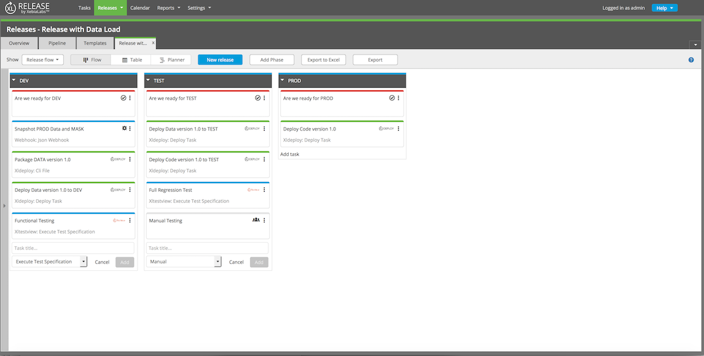

XL Release can help you prepare your environments for testing through [tasks](/xl-release/concept/types-of-tasks-in-xl-release.html) that load test data in environments.

XL Release is designed to model your release processes and help you improve them by eliminating waste and delays. Automating the process of preparing test environments so that they accurately represent your live environments is an area that can return significant improvements. 

## Deploying versioned test data

Through the [Database plugin](/xl-deploy/concept/database-plugin.html), XL Deploy can deploy test data, and roll it back if needed.

XL Release can load the test data in the environments where it is required. This is an example of a release that will load data in the Development and Test environments. Test data is not required in the Production environment.

## Third-party data virtualization integration

Tools such as [Delphix](https://www.delphix.com/) can virtualize your production data and make it available in test environments. This process involves normalizing data and masking sensitive information, so the process complies with data protection standards.

XL Release can integrate with these types of tools through the [Webhook task type](/xl-release/how-to/create-a-webhook-task.html). Webhook tasks communicate with tools through REST APIs (such as the [Delphix API](https://docs.delphix.com/display/DOCS50/Web+Service+API+Guide)).
