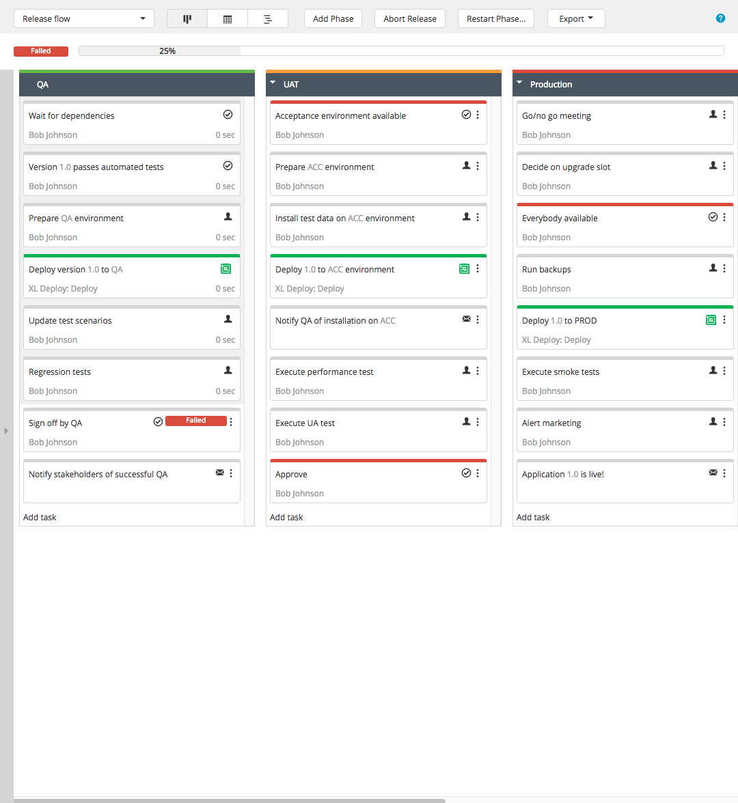
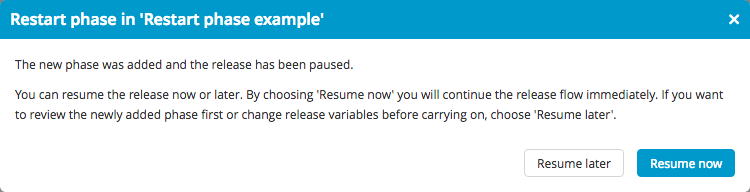
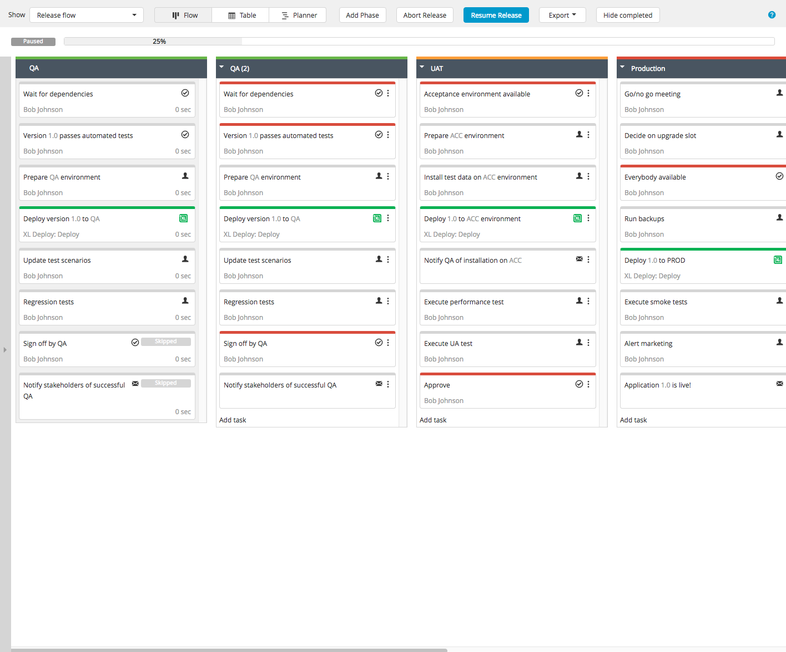

In an active release, you can abort the current phase and restart the execution from any phase in the past. This can be required if some parts of the release procedure must be repeated. For example, QA rejects a version of the application for release and the test phase must be repeated with an updated version.

When you restart the release from a previous phase:

1. The current phase is interrupted
1. All remaining tasks are skipped
3. The release is paused
4. XL Release makes a copy of all previous phases that need to be repeated

The release owner can change variable values and task details before reinitiating the release flow.

**Note:** If you want to specify the *task* from which to restart the phase, you must have permission to skip all tasks before the current one; that is, you either have the `edit#task` permission on the release, or you or your team own the tasks before the current one. If you do not have permission, you can only restart the phase from the first task.

## Example

This is an example of how restarting a phase works in practice. Suppose you have a release with three phases: QA, UAT, and Production.

The QA phase was started with version 1.0 of the product, but bugs were found and QA could not sign off. So the **Sign off by QA** task failed. The Dev team is notified and produces a fix: version 1.0.1. You can now start the QA phase again for version 1.0.1.

Click **Restart Phase...** in the top bar to open the *Restart phase* window. Select the version of the phase: **Latest** or **Original**. Select the phase and task from which the release should be restarted.

Click **Continue** to confirm the restart. Alternatively, click **Cancel** to discard the restart.

After you continue, the release is paused and the new phases are created.

Click **Resume now** to continue the release flow immediately. If you click **Resume later**, the release remains in the 'paused' state. This allows you to edit tasks and release properties before continuing.

**Note:** Prior to XL Release 6.0.0, you can edit release variables in this step. In XL Release 6.0.0 and later, you can edit variables by clicking **Resume later** and then selecting **Variables** from the **Show** menu.

XL Release creates a phase called **QA (2)**. You can still modify its content. For example, suppose that the task **Update test scenarios** is no longer relevant; you can remove it.

To resume a paused release, click **Resume Release** in the top bar.
