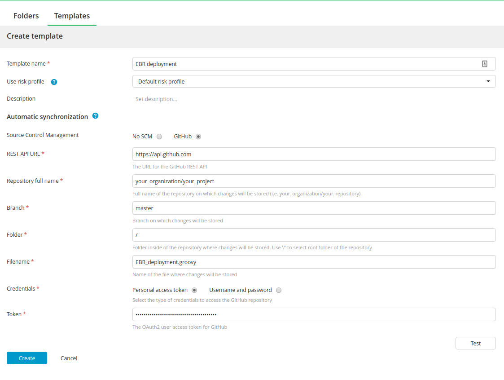

As of XL Release 8.1.0, you can store template versions in a Source Control Management (SCM) tool. This provides easier management of all the artifacts, the possibility to store them together with Releasefiles and Jenkinsfiles, to configure and to use them from a release pipeline.

To configure automatic synchronization in XL Release:
1. In the top bar, click **Design**.
1. Click **Templates**.
1. Click a template.
1. From the **Show** drop-down, click **Properties**.
1. Under **Automatic synchronization**, select **GitHub**.
 The following options are available:
   No SCM if this option is selected templates will not be connected to an SCM.
   GitHub if this option is selected template changes will be pushed to the configured GitHub repository.
6. Click **Save**.

Currently available options are:

 No SCM if this option is selected template will not be connected to an SCM.
 GitHub if this option is selected template changes will be pushed to the configured GitHub repository once the **New version** of the template is created on the **Version control** page.
 
## GitHub connection options

To setup GitHub connection:

1. In the **Repository full name** field, enter the qualified name of the GitHub repository (`<organization_name>/<project_name>`).
1. In the **Branch** field, enter the name of the branch to which changes will be pushed. **Note:** The default value is `master`.
1. In the **Folder** field, enter the name of the folder to which changes will be pushed. **Note:** The default value is `/`, which represents the top-level folder in the selected repository.
1. In the **Filename** field, enter a file name to which changes will be pushed. **Note:** The file name should consists of a name and an extension. For example, `EBR_deployment.groovy`.
1. In the **Credentials** section, select :
   **Personal access token** Create your own [personal access token](https://help.github.com/articles/creating-a-personal-access-token-for-the-command-line/) in GitHub settings.
*Or*
   **Username and password** Provide username and password to access GitHub.
1. Click **Save**.   
