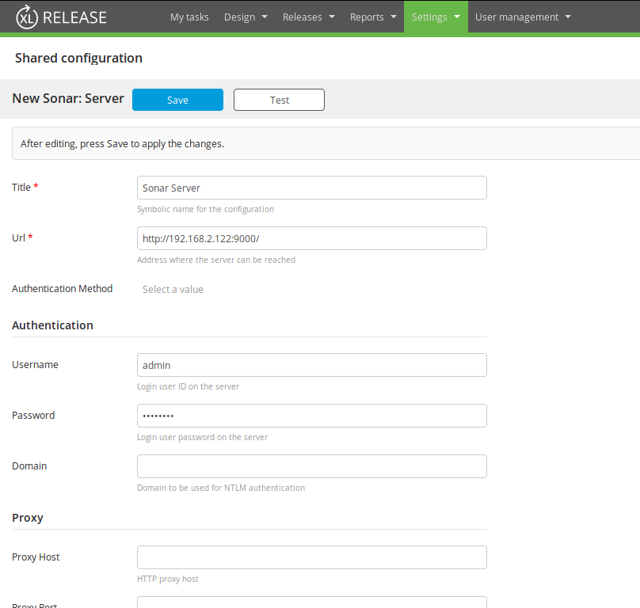
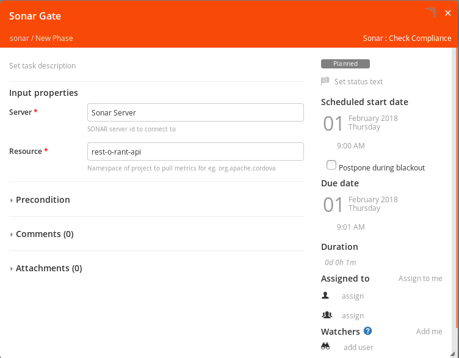
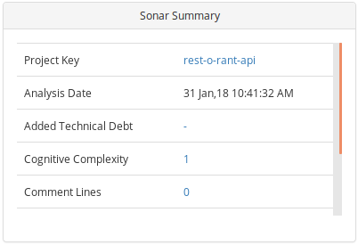

The XL Release [Sonarqube](https://docs.sonarqube.org/display/SONAR) plugin allows XL Release to work with reports and metrics from a sonar server.

The following task types are included:

* **Sonar: Check Compliance**

In the [release flow editor](/xl-release/how-to/using-the-release-flow-editor.html), the sonar tasks have a red border.

The following tile types are included:

* **Sonar Summary**

## Features

* Create a Sonar: Check Compliance task
* Configure a Sonar Summary tile on the Release dashboard

## Requirements

The Sonar plugin requires the following:

* Sonar server running and accessible via HTTP(s)
* A FPR artifact uploaded in the Sonar for the application
* Configured Sonar quality gate

## Set up a Sonar server

Define a Sonar server as the first item under shared configurations.

To set up a connection to a Unix server with the installed OpenShift client:

1. In XL Release, go to **Settings** > **Shared configuration** and under **Sonar: Server**, click **Add Server**.
1. In the **Title** box, specify a name for the Sonar server.
1. In the **URL** box, specify the URL where the Sonar server can be reached.
1. In the **Username** and **Password** boxes, specify the login user name and password of the user on the server.

## Create Sonar Check Compliance task

The **Sonar: Check Compliance** task type creates a gate in the release flow that fails if the project metrics does not match the metrics configured in quality gate.

To add a Sonar: Check Compliance task:

1. In the release flow tab of a Release template, add a task of type **Sonar** > **Check Compliance**.
1. Open the added task and in the **Server** box, select the added Sonar server.
1. In the **Resource** box, add the project for which the compliance needs to be verified.

## Sonar Summary tile

The **Sonar: Summary** tile type creates a dashboard tile that displays the metric information of the selected project and version.

To configure a Sonar Summary tile:

1. In the release dashboard tab of a Release, click **Configure** > **Add tile** > **Sonar Summary**.
1. Click the gear icon to configure the added tile.
1. In the **Server** box, select the added Sonar server.
1. In the **Resource** box, add the project for which the metrics need to be viewed.
1. In the **Metrics** auto-suggest box, type the name of the metrics you want to add and select from the displayed list.
1. Click **Save**.

The tile displays the selected metrics or the appropriate error message if an error occurs.

