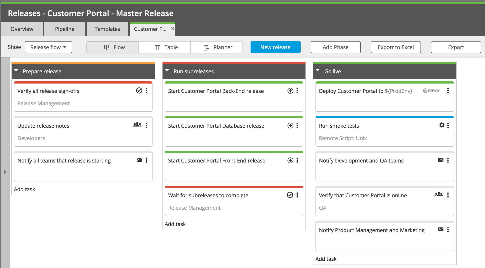
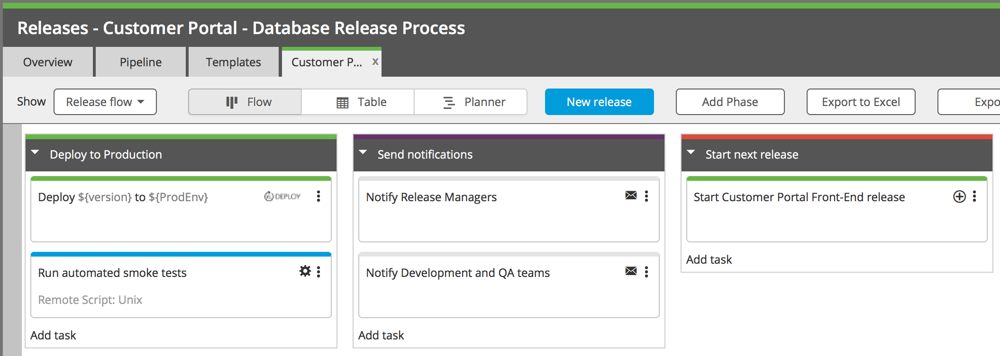

The [Create Release task type](/xl-release/how-to/create-a-create-release-task.html) allows you to automatically create and start a release based on a configured template. You can use the Create Release task for several different release orchestration scenarios.

## Master release with subreleases

In the "master release" scenario, one release starts several "subreleases" and then waits for them to finish. A Create Release task starts each subrelease, and you can use one or more Gate tasks to cause the master release to wait until the subreleases are complete.

The Create Release task and Gate task are linked through a [variable](/xl-release/how-to/create-release-variables.html). You can configure each Create Release task to return the unique ID of the newly created release in an output variable. Then, you can add each variable as a [dependency](/xl-release/how-to/create-a-gate-task.html#dependencies) in a Gate task.

This is an example of a master release that will start three subreleases:

This is one of the Create Release tasks, showing the output variable that will be populated with the new release's ID:

And this is a Gate task that will wait for all three of the subreleases to finish:

### Subreleases in the release timeline

On the [release dashboard](/xl-release/how-to/using-the-release-dashboard.html), the detail view of the [release timeline tile](/xl-release/concept/release-dashboard-tiles.html#release-timeline) shows the subreleases that are created from the master release. This makes it easy to see the relationship between the releases and whether the subreleases will cause delays in the master release. For example, in a master release with many subreleases:

## Kickstart release

Another scenario is a "kickstart" release that only serves to start other releases, and does not wait on them to finish. This is useful if you have many small releases that you want to run in parallel. For example:

The Create Release tasks would be configured just as as in the master/subrelease scenario, though the use of output variables would be optional in this case.

## Release chain

You can also use the Create Release task to "chain" releases together by starting a new release near or at the end of a release. This is useful if you have several releases that you want to run in sequence.

For example, just before this release ends, it will start another release:

And the subsequent release will do the same:

## Recurring releases

Similar to a release chain, you can use the Create Release task to create a series of recurring releases, all based on the same template. This is useful for modeling sprints in releases.

For example, just before this release ends, it will start another release based on the same template:

