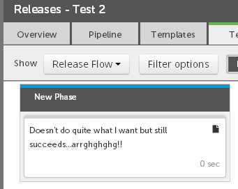
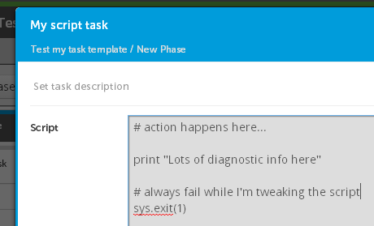
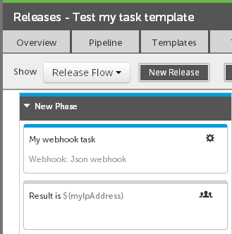

When you're configuring an automated task such as a Webhook, Script, or custom task, for the first time while creating a release template in XL Release, you usually need to test and tweak it a few times before the configuration is correct.

That's easy, no? Simply make your task the only task in a dummy template, start a release from the template and your task will run!

Well... yes, that will work, but it's only really useful if your task either does exactly the right thing first time around (in which case, good for you!), or if it totally fails, such as when a Webhook returns a non-2xx response code.

If your task fails, you can easily change its configuration and retry it. But if it doesn't do quite the right thing without failing, or doesn't return the output values that you expect, for example, then this approach is less useful: since the task succeeded, the dummy release is now complete, and you can't retry the task anymore.

## Retry an automated task

There are two approaches to avoiding this when testing an automated task.

If the task is a script or a custom task, you can adjust the script to print diagnostic information you need, and then always fail. This allows you to retry the task as often as needed while tweaking the script or custom task. Once you are satisfied that the task is doing what it should be, you can change the "exit logic" to fail only if something didn't work as expected.

If you are working with an automated out-of-the-box task such as a webhook, or if you need to verify that a task is setting any output variables correctly, you can add a manual task after the automated task and include the output variables you want to inspect in the manual task's description.

In this case, if the automated task succeeds, you can't simply retry it. But, because the release hasn't completed yet, you can restart the phase containing the automated and manual task. If you choose to restart the release later, you can tweak the configuration of the automated task before re-running it by starting the release again. The automated task can be re-run multiple times, simply be restarting the last phase as often as needed.

## Keeping your overview screens clean

Remember to abort any dummy releases created in this way, if they have not already completed! Otherwise, your release overview can quickly look something like this, which is less than ideal.

Aborted releases are stored in the system, but they (like completed releases) are not shown by default. You can easily browse through them by changing the filter settings for the release overview and other screens.

