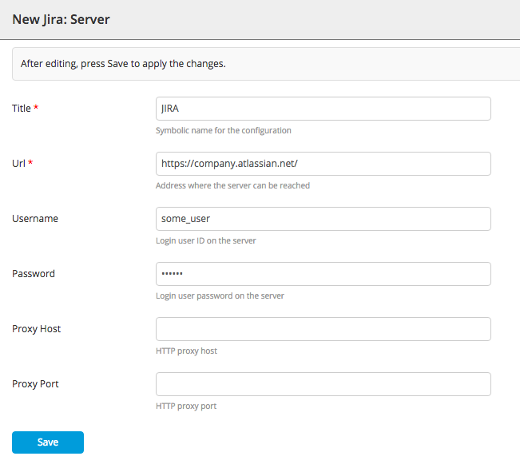
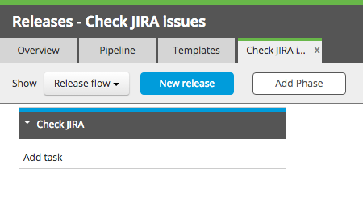
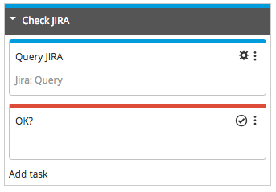
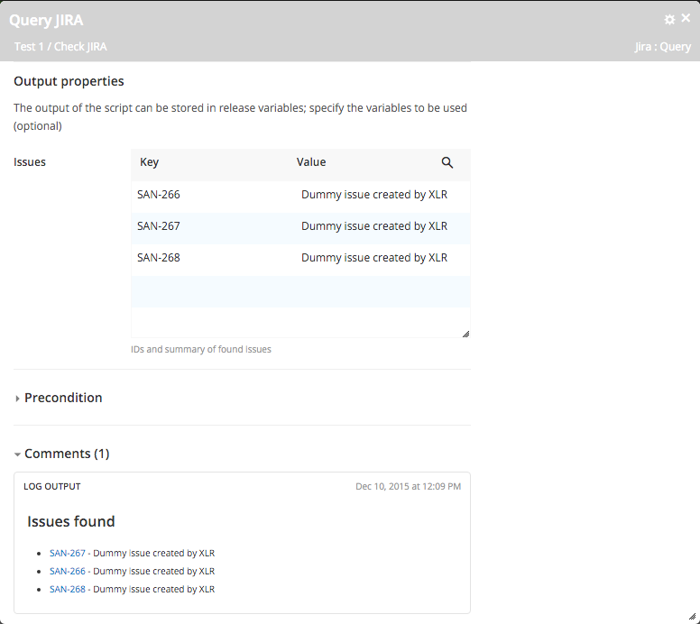
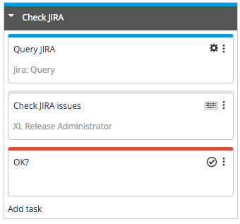
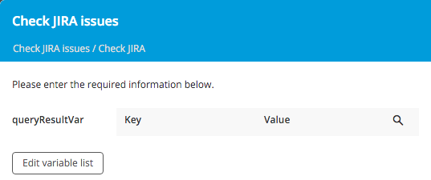
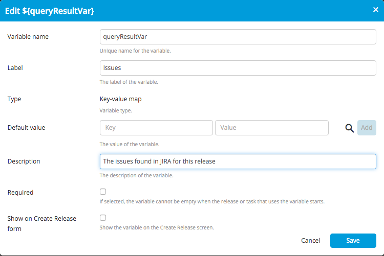
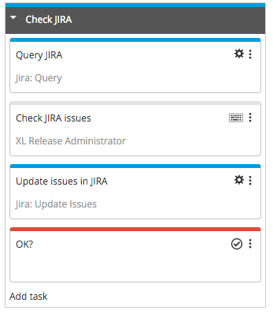

This tutorial will show you how to use the extended variable mechanism (available in XL Release 4.8.0 and later) to create a release that will:

1. Retrieve a list a of issues from Atlassian JIRA
2. Ask a user to revise the list
3. Update the issues in JIRA

To follow this tutorial, you need access to a JIRA server. In XL Release, you need the following [global permissions](/xl-release/how-to/configure-permissions.html):

* **Admin** to configure the JIRA server
* **Create Template** for the rest of the tutorial

## Step 1 Configure the JIRA server in XL Release

First, you need to configure the JIRA server in XL Release, so the release will be able to connect to it.

Go to **Settings** > **Configuration** and add a JIRA server.

Enter the information for the JIRA server that you want to access. This server will be available to all releases. You can provide the user name and password here, or set them on the release level.

## Step 2 Create a release template

Next, create a reusable release template.

Go to **Templates** and create a new template called *Check JIRA issues*. In the release flow editor, name the first and only phase of the release *Check JIRA*.

For now, do not set up teams and permissions for the template (see [Configure release teams](/xl-release/how-to/configure-teams-for-a-release.html) for more information).

## Step 3 Add tasks to the template

The release will flow as follows:

1. Query JIRA to get a list of issues
2. Allow users to revise the list by adding or removing issues
3. Update the the issues with a comment in JIRA

For each step, you add a task to the *Check JIRA* phase of the template. Variables will be used to connect the information flow between the tasks.

## Step 4 Query issues in JIRA

Click **Add task** at the bottom of the *Check JIRA* phase and select **Jira: Query** from the drop-down list. Name the task *Query JIRA* and click **Add** to add it to the phase.

Now, click the *Query JIRA* task to configure it.

The JIRA server that you configured should automatically be selected in the **Server** box. If you provided the user name and password in the server configuration, you do not need to fill them in here.

In the **Query** box, you can enter any query in the [JIRA Query Language (JQL)](https://confluence.atlassian.com/jira/advanced-searching-179442050.html). In the example above, the query is:

    project = "Sandbox" and status = Open and text ~ "Dummy"

This means "Give me all open issues of the 'Sandbox' project that have text 'Dummy' in them".

Use JIRA to develop a query that works for your project, then paste it in the **Query** box.

## Step 5 Test the release

Before continuing, test the *Query JIRA* task to ensure that it works.

When testing a release, it's good practice to put a simple Gate task at the end of the release, to prevent it from finishing automatically. Click **Add task** at the bottom of the *Check JIRA* phase and add a **Gate** task called *OK?*.

Now, click **New Release** at the top of the template to create a new release called *Test 1*.

After you create the release, click **Start Release** to start it. Wait for the *Query JIRA* task to finish.

After it finishes, click the task to open it. You can see the results in two places:

* Next to **Issues** in the **Output properties** section. You will use this later to put the result of the query in a variable that can be used in another task.
* Under **Log Output** in the **Comments** section. You can click the links here to open the issues in JIRA.

## Step 6 Revise the issue list

Now, you can capture the output of the JIRA query and allow a user to revise it. Go back to the *Check JIRA issues* template and open the *Query JIRA* task. In the **Issues** box under **Output properties**, type `queryResultVar` and press ENTER.

This creates a new variable called `${queryResultVar}`. The result of the JIRA query will be stored in it, and you can use the variable in another task.

The [User Input task type](/xl-release/how-to/create-a-user-input-task.html) allows you to ask users to enter and/or verify information during the release process. The information is stored in variables that are added to the task. In this case, you will configure a User Input task to ask a user to confirm the list of JIRA issues before continuing with the release process.

Click **Add task** at the bottom of the *Check JIRA* phase and add a **User Input** task called *Check JIRA issues*. Drag-and-drop the task below the *Query JIRA* task. The template should look like this:

Now, you can configure the *Check JIRA issues* task to display the contents of the `queryResultVar` variable, which will contain the issue list. Open the task and click **Edit variable list** to access the User Input task in "edit mode".

Select `${queryResultVar}` from the drop-down list and click **Save**.

The result does not show the JIRA issues yet, because this is a template. Now, you can make the form more user-friendly.

Click the pencil icon next to the "Please enter the required information below" description and enter *Please revise the issue list below. Remove any tickets that should not be updated.* This is the message that the user will see when the release is in progress.

Now, close the task and select **Variables** from the **Show** menu at the top of the template. This will take you to the Variables screen, where you can find an overview of all variables that are being used in the release or template.

Click `${queryResultVar}` to edit it. Here, you can enter a user-friendly label and description that will appear in the *Check JIRA issues* task:

Save the changes and select **Release flow** from the **Show** menu to go back to the release flow editor. Open the *Check JIRA issues* task to see the changes that you made. Also, click **Assign to me** to ensure that the task is assigned to you while you test the release.

## Step 7 Test the release again

Now you can test the release again. Create a new release called *Test 2* and start it. When the release reaches the *Check JIRA issues* task, it will wait for input. Open the task:

Try removing a few issues, then click **Complete**. To check the result of your actions, select **Variables** from the **Show** menu and click the `${queryResultVar}` variable.

## Step 8 Update the issues in JIRA

The final thing left is to add a comment to the selected issues in JIRA. Go back to the *Check JIRA issues* template. Click **Add task** at the bottom of the *Check JIRA* phase and add a **Jira: Update issues** task called *Update issues in JIRA*. Drag-and-drop the task below the *Check JIRA issues* task. The template should look like this:

Click the *Update issues in JIRA* task to configure it. Select the same JIRA server as you used in the *Query JIRA* task.

When the task starts, the `${queryResultVar}` variable will contain the list of issues, with the changes that the user made in the *Check JIRA issues* task. Click  next to **Issues** to see the list of available variables.

Select `${queryResultVar}` from the drop-down list.

The Jira: Update Issues task type allows you to change the status of issues, update their summaries, and add comments. In this tutorial, you will just add a comment. Enter a comment such as *Updated from XL Release!* in the **Comment** box.

## Step 9 Test the release a final time

The template is now complete, so you can do a final test. Create a new release called *Test 3* and start it. In the **Log Output** section of the *Update issues in JIRA* task, you will see which issues have been updated.

Click the links to open the issues in JIRA.

## Conclusion

With variables, XL Release allows you to connect the steps in your release process together. Variables are a powerful mechanism that you can use for automated tasks and to interact with users in a user-friendly way.
