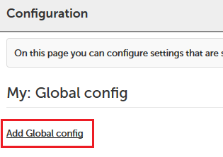
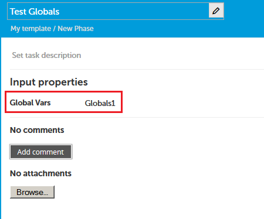
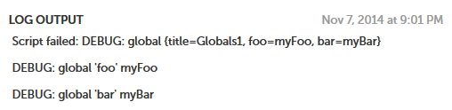
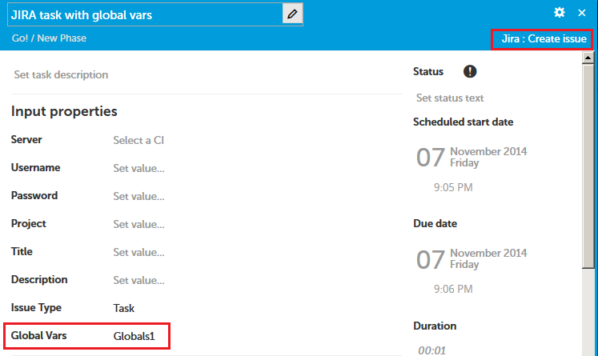

XL Release allows you to define *configuration objects* to store settings that will be used across many tasks or even task types, or information that needs to be accessible in tasks but which the user configuring the task may not know. Common examples are things like connection information for Jenkins or JIRA servers, or remote hosts on which to execute scripts.

You can easily define your own configuration types, too, to share information between custom tasks or even to make information available to out-of-the-box task types that you would like to extend.

Here, we'll use a configuration object to store a number of "global variables" and reference those within a custom task type.

## Defining the configuration type

First, we need to define our configuration type. There are two "base types" that we can use for this, `xlrelease.Configuration` and `configuration.HttpConnection`. The latter is useful if you're looking to define any kind of HTTP endpoint, but in this case we're looking for something much more basic:

    <type type="my.GlobalConfig" extends="xlrelease.Configuration">
        <property name="foo" label="Foo (this does X)" />
        <property name="bar" required="false" label="Bar (this does Y)" />
    </type>

Here, we've defined a very simple configuration type with two properties, foo and bar. Properties can be required or optional and can be marked as "password" properties if desired.

## Creating a configuration object

Once we have defined our configuration type, we create a configuration object of that type under **Settings** > **Shared configuration** in the XL Release UI:

We could create multiple configuration objects, but since we're here looking to define global variables, a single instance is presumably what we want:

**Note:** Prior to XL Release 6.0.0, this page is called **Configuration**.

## Linking the configuration type to custom task types

In order to access the configuration object from a custom task, we need to add a reference to the definition of our custom task type:

    <type type="my.SampleTask" extends="xlrelease.PythonScript">
        <property name="globalVars" kind="ci" referenced-type="my.GlobalConfig" required="false" category="input" />
    </type>

This will allow the user creating an instance of a custom task to select a configuration object for that task. We could specify that choosing a configuration object is optional, but in our case it makes more sense for it to be required. It's important to remember to specify `category="input"` for the property, as this (amongst others) tells XL Release to expose it to the task implementation.

## Using the configuration object from the task implementation

The property is exposed to the task implementation as a Jython variable of the same name as the property. Configuration objects are accessible as Jython maps. Here's a trivial example that simply prints the global values:

    import sys

    print "DEBUG: global", globalVars, "\n"
    print "DEBUG: global 'foo'", globalVars['foo'], "\n"
    print "DEBUG: global 'bar'", globalVars['bar'], "\n"

    sys.exit(1)

The script is saved as `XL_RELEASE_SERVER_HOME/ext/my/SampleTask.py`, as per the standard XL Release naming convention for task implementations. Note that we're making the script fail here for easier development and debugging. See this forum post for details.

## Creating a custom task and linking it to a configuration object

When a user creates a task of our custom task type in the UI, they can link the task to a configuration object. If there is only one of these, as in our case, it is automatically set as the default:

## Running the custom task

Executing the custom task as part of a release gives the expected result:

## Linking the configuration to standard task types

You can also add a reference to a configuration object to existing task types that extend from `xlrelease.PythonScript`, such as webhooks or the JIRA or Jenkins tasks:

    <type-modification type="jira.CreateIssue">
        <property name="globalVars" kind="ci" referenced-type="my.GlobalConfig" category="input" />
    </type-modification>

This will then allow users to select a configuration object for those tasks too, just as for our custom tasks above:

Of course, you will need to override the default script for the task to make use of the configuration object. You can find out which task types extend from `xlrelease.PythonScript` by checking out their type definitions in the appropriate `synthetic.xml` type definition file.
