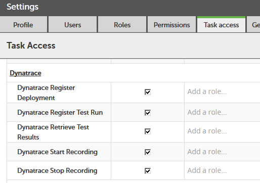
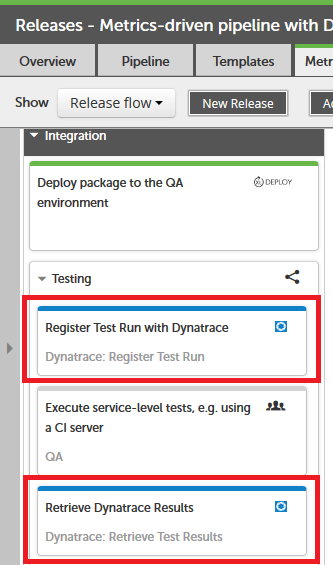
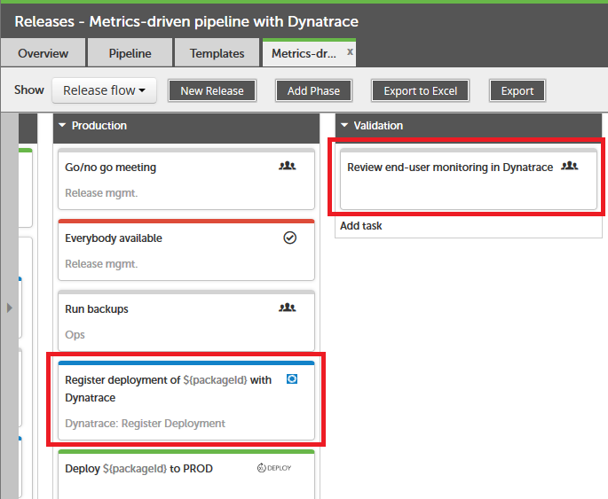
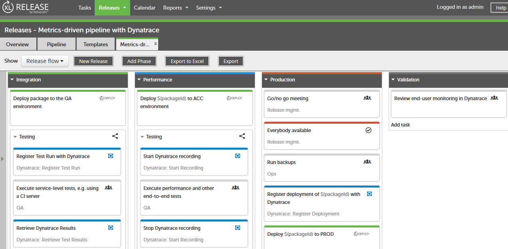

You can use XL Release with [Dynatrace](http://www.dynatrace.com/en/index.html) to integrate service-level, business application-level, and user-level metrics about your applications. This gives you an earlier and more accurate picture of the architectural quality of your software. After the application goes live, this also gives you detailed insight into how your users are actually working with it, so you can more more effectively determine whether the features you have just released are successful.

## Preparation

1. If you are not already a Dynatrace user, [download and install it](http://www.dynatrace.com/en/products/dynatrace-free-trial.html).
2. If you are not already an XL Release user, [download](https://xebialabs.com/products/xl-release/trial/) and [install](/xl-release/how-to/install-xl-release.html) it.
3. Download the latest version of the [XL Release Dynatrace community plugin](https://github.com/xebialabs-community/xlr-dynatrace-plugin) and copy it to the `XL_RELEASE_SERVER_HOME/plugins` directory.
4. Start the XL Release server. You will see that the following new [task types](/xl-release/concept/types-of-tasks-in-xl-release.html) are available:

    

## Collecting service-level metrics

Dynatrace's [Test Automation feature](https://community.dynatrace.com/community/display/DOCDT62/Test+Automation+Explained) collects integration test metrics such as the number of database queries, the number of calls to a web service, the size of a web service's response, and so on.

In XL Release, you can use a Register Test Run task to register a test run in Dynatrace before calling your continuous integration (CI) server or integration test harness. You can then use a Retrieve Test Results task to get the analysis from Dynatrace and make a manual or automated decision about whether to continue the release.

## Collecting business application-level metrics

You can also use Dynatrace to monitor and report on application performance characteristics when doing performance and stress testing.

In XL Release, you can use a Start Recording task to automatically trigger Dynatrace to start a data recording session just before you start running performance tests. The description of the recording session links to the XL Release release, so other users can immediately see what the session is about.

You can then use the Stop Recording task to immediately end the recording after the performance test is complete, ensuring that you do not have to manually remove unrelated data from Dynatrace reports and visualizations. Also, XL Release links directly to Dynatrace reports, so other users can see the analysis and efficiently decide whether to proceed with the release.

## Collecting user-level metrics

Dynatrace's [User Experience Management](http://www.dynatrace.com/en/user-experience-management/) collects metrics about application versions after they are live in Production; for example, the level of Android versus iOS app usage, the number of successfully completed transactions from a certain region, the average response time in a particular geography, or any other user-level metric.

However, to get a true "before/after" view of an application, you need to determine the correct moment to use for comparison. XL Release does this for you automatically. You can use the Register Deployment task to quickly jump to the correct "before/after" view. You can even have multiple Register Deployment tasks for different milestones in a phased go-live scenario.

Information about the release and a direct link to XL Release are automatically added to the event record in Dynatrace, so all users can quickly see what was involved in the deployment and find more details about the release if needed.

## Putting it all together

This is an example of a release that collects all three types of metrics:

**Important:** The [XL Release Dynatrace plugin](https://github.com/xebialabs-community/xlr-dynatrace-plugin) is a community plugin that is not officially supported by XebiaLabs. If you have questions, please contact the [XebiaLabs support team](https://support.xebialabs.com).
